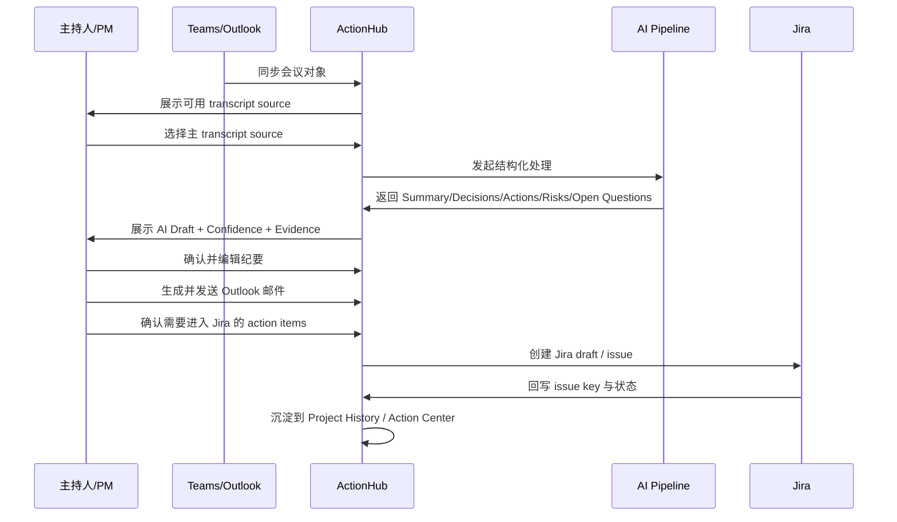
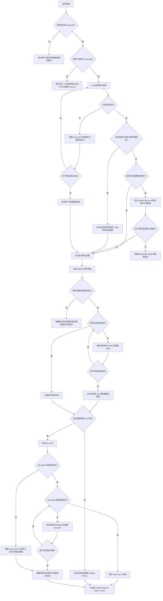

# Espressif ActionHub PRD

## 1. 摘要
Espressif ActionHub 是一个面向内部混合会议场景的会议结果协同平台。它连接 `Teams`、`Outlook`、会议室终端、`Jira` 与 `EHR`，把“会后人工整理纪要、手动抄任务、历史会议割裂”的流程，升级为“结构化纪要、人工确认、任务流转、历史追踪、持续优化”的闭环。

本版本 PRD 以已确认原型为准，覆盖 9 个页面：`Dashboard`、`Meetings`、`Meeting Detail`、`My Action Items`、`Project History`、`Templates & Rules`、`Integrations & Admin`、`Action Center`、`AI Ops`。全局采用 `Modern Enterprise Collaboration UI` 风格，并在顶部导航提供 `中 / EN` 语言切换。

## 2. 角色与协作对象
| 角色 | 主要目标 | 核心操作 |
|------|----------|----------|
| 项目经理 / PM | 快速完成纪要确认、任务分派、邮件发送、Jira 建单 | 选择 transcript、确认 AI 草稿、发送邮件、同步 Jira |
| 研发负责人 / Tech Lead | 快速抓住决议、风险、阻塞项和后续动作 | 查看会议结果、补充 owner / deadline、确认 blocker |
| 参会成员 | 明确自己要做什么，能快速回看背景 | 查看纪要邮件、查看与自己有关的 action item、回看历史会议 |
| 管理员 | 维护模板、规则、集成状态和优化配置 | 配置模板、测试连接、查看日志、处理 badcase |

## 3. 背景与问题
当前内部混合会议依赖 `Teams / Outlook` 订会，线下会议室和线上参会并存。会议结束后通常要人工整理纪要，再通过 Outlook 发送，并把 action items 手动录入 Jira。该流程有 4 个核心问题：

1. 纪要整理耗时高。
2. Action items 纯手动创建，容易遗漏。
3. 历史会议无法按项目连续沉淀。
4. 录音、录屏与后续推进没有形成可执行闭环。

## 4. 产品目标
### 4.1 业务目标
1. 显著减少会后纪要整理时间。
2. 降低 action item 漏提和漏同步概率。
3. 让会议结果可确认、可编辑、可发送、可建单、可追踪。
4. 为后续 AI 能力模块化沉淀统一输入输出与 badcase 优化闭环。

### 4.2 成功指标
以下指标默认以试点项目为统计范围，统计周期为连续 `8-12` 周。若正式上线前拿不到历史基线，则先以试点首 `2` 周数据作为基线。

#### MVP / Phase 1
| 指标 | 统计口径 | 基线 | 目标 |
|------|----------|------|------|
| 会后纪要整理中位时长 | 从会议结束到主持人完成纪要确认的中位时长 | `30` 分钟 | 降到 `15` 分钟以内 |
| Outlook 纪要发送中位时延 | 从纪要确认完成到邮件成功发送的中位时长 | `20` 分钟 | 降到 `5` 分钟以内 |
| AI 草稿采用率 | 直接在 AI 草稿上编辑并发送的会议数 / 已生成 AI 草稿的会议数 | `0%` | 达到 `>= 70%` |
| Action item 提取采纳率 | 被用户保留并进入确认流的 action items / AI 提取 action items 总数 | `0%` | 达到 `>= 80%` |
| Jira 草稿转正式任务率 | 成功创建 Jira issue 的 action items / 已生成 Jira draft 的 action items | `0%` | 达到 `>= 60%` |
| Project History 周活查看率 | 每周至少查看 1 次项目历史页的试点用户数 / 试点用户总数 | `0%` | 达到 `>= 40%` |

#### Phase 2
| 指标 | 统计口径 | 基线 | 目标 |
|------|----------|------|------|
| 跨会议未完成事项跟进率 | 在连续两次会议中被重新识别并更新状态的未完成事项数 / 跨会议未完成事项总数 | `0%` | 达到 `>= 65%` |
| 连续 blocker 识别命中率 | 被用户确认“识别正确”的连续 blocker 提示数 / 连续 blocker 提示总数 | `0%` | 达到 `>= 75%` |
| Owner / deadline 纠错率下降 | 需要人工改写 owner 或 deadline 的 action items / 已确认 action items 总数 | `35%` | 降到 `<= 15%` |
| AI Ops 闭环时效 | 从 badcase 创建到状态变为已解决的中位耗时 | `无基线` | 控制在 `7` 天以内 |
| 模块级 badcase 回归通过率 | 修复后回归通过的 badcase 数 / 纳入回归集的 badcase 总数 | `0%` | 达到 `>= 90%` |

## 5. 产品定位与原则
### 5.1 产品定位
ActionHub 不是替代 `Teams` 的会议工具，而是在现有会议基础设施之上，增加一层会后结构化处理、人工确认、邮件同步、任务流转与持续优化能力。

### 5.2 设计原则
1. `workflow` 是主干，AI 是受控增强，不是黑箱自动化。
2. 高影响动作必须保留人工确认。
3. 先展示结论，再展示原始 transcript。
4. AI 内容必须显式展示 `AI Draft`、`Needs Review`、`Confirmed`、`Confidence`。
5. Phase 2 能力增强主流程，但不能压垮 MVP 工作台。

## 6. 版本范围与优先级
| 模块 | MVP | Phase 1 | Phase 2 |
|------|-----|---------|---------|
| 会议对象接入 | P0 | 持续稳定 | 持续稳定 |
| 主 transcript 选择 | P0 | P0 | P0 |
| AI 结构化纪要 | P0 | P0 | 模块化增强 |
| Outlook 邮件草稿与发送 | P0 | P0 | P0 |
| Jira 草稿与创建 | 预留/轻展示 | P0 | P0 |
| My Action Items | 轻入口 | P0 | P0 |
| Project History | P0 | P0 | 跨会议增强 |
| Templates & Rules | P1 | P1 | 模块化配置中心 |
| Integrations & Admin | P1 | P1 | P1 |
| Action Center | - | 轻能力前置 | P0 |
| AI Ops | - | - | P0 |
| AI Skills | - | - | P0 |
| EHR 路由 | 预留 | 预留 | P1 |
| 中 / EN 切换 | P1 | P1 | P1 |

## 7. 确认后的页面范围
### 7.1 全局框架
- 左侧全局导航
- 顶部导航：搜索、项目切换、通知、用户信息、`中 / EN` 切换
- 主工作区
- 详情页优先采用三栏工作台
- 列表页优先采用筛选条 + 表格 + 抽屉 / 预览

### 7.2 页面清单
| 页面 | 阶段 | 目标 |
|------|------|------|
| `Dashboard` | MVP | 会议协同总览 |
| `Meetings` | MVP | 会议列表与筛选 |
| `Meeting Detail` | MVP | 会后确认工作台 |
| `My Action Items` | Phase 1 | 个人任务入口 |
| `Project History` | Phase 1 | 项目维度历史沉淀 |
| `Templates & Rules` | MVP | 模板与规则配置 |
| `Integrations & Admin` | MVP | 集成与后台状态 |
| `Action Center` | Phase 2 | 跨会议 action 闭环中心 |
| `AI Ops` | Phase 2 | AI 模块优化后台 |

## 8. 页面与功能说明
### 8.1 Dashboard
目标：让用户一进来就知道今天要处理什么。

功能：
- 今日 / 本周会议
- 待确认纪要
- 待发送邮件
- 待同步 Jira
- 项目维度未完成 action items
- blocker / 风险提醒
- AI 处理效果概览
- Teams / Outlook / Jira / EHR 连接状态
- 会议终端在线状态
- AI 微交互：趋势提醒、异常洞察、推荐优先处理项

### 8.2 Meetings
目标：快速找到会议并进入处理。

功能：
- 按项目、时间、会议类型、主持人、状态筛选
- 搜索会议标题、项目名称、参会人
- 查看来源类型：`Teams / Terminal / Hybrid`
- 查看纪要状态、邮件状态、Jira 状态
- 右侧会议预览
- 列表级 AI 提示：置信度、待补 action item、同步异常提醒

### 8.3 Meeting Detail
目标：在一个页面完成“看、改、发、建”。

布局：
- 左栏：会议基础信息、主 transcript source、时间线 transcript
- 中栏：`Summary`、`Decisions`、`Action Items`、`Risks / Blockers`、`Open Questions`
- 右栏：Outlook 邮件预览、Jira 任务预览、状态与操作区

功能：
- 选择或查看主 transcript source
- AI 结构化结果展示与编辑
- section 级 `Confidence`
- 来源证据芯片与 transcript 高亮联动
- 遗漏 action item 提示
- 邮件草稿生成与发送
- Jira 草稿生成与确认
- EHR 通知预览占位

### 8.4 My Action Items
目标：让个人快速处理与自己有关的后续动作。

功能：
- Pending / Overdue / Needs Review KPI
- 列表展示任务、来源会议、截止时间、状态、路由去向
- 按项目、状态、截止时间筛选
- 查看任务详情抽屉
- 返回原始会议
- AI 排序提示与状态修正建议

### 8.5 Project History
目标：让会议结果按项目连续沉淀，而不是一封邮件就消失。

功能：
- 按项目查看历史会议
- 查看每次会议纪要摘要与 action item 数量
- 搜索会议标题 / 日期
- 跨会议模式识别提醒
- 行内显示会议间关联关系

### 8.6 Templates & Rules
目标：提供轻量可控的模板与路由配置入口。

功能：
- 会议类型模板配置：项目周会、技术评审会、风险同步会
- 邮件模板配置
- Action item 路由建议规则
- 风险 / blocker 展示规则
- AI 模块开关与采用率反馈

### 8.7 Integrations & Admin
目标：让管理员快速理解系统连接状态并处理异常。

功能：
- Teams / Outlook / Jira / EHR 连接状态
- 会议终端状态
- 最近同步日志
- 重新授权 / 测试连接
- 集成卡片式展示与状态告警

### 8.8 Action Center
目标：把单场会议的任务处理升级为跨会议闭环管理。

功能：
- 所有项目 action items 聚合
- 总待办、逾期、跨会议未关闭、高优先级 KPI
- 待补 owner / deadline 项
- AI 洞察 Banner：重复出现的 follow-up、跨会议未关闭事项
- Skills 推荐区：行动项聚焦、风险扫描、跨会议 follow-up、管理层摘要
- 统一筛选与批量处理
- 表格查看标题、项目、负责人、截止时间、状态、同步路由、来源会议

### 8.9 AI Ops
目标：把 AI 问题从单点抱怨，升级成可分类、可修复、可回归的优化闭环。

功能：
- 模块级指标：抽取召回、owner 准确率、deadline 准确率、badcase 数量
- Action item 漏提反馈
- Owner / deadline 识别错误反馈
- Badcase 列表与分类
- 模板效果分析
- 会议类型识别效果
- Skills Registry：技能开关、版本、采用率、失败率、badcase 分布
- 优化建议 Banner 与回归状态

## 9. 页面跳转关系
1. `Dashboard` 点击会议、待确认纪要、待同步 Jira 可进入 `Meeting Detail`。
2. `Dashboard` 点击项目可进入 `Project History`。
3. `Meetings` 点击任意会议进入 `Meeting Detail`。
4. `Meeting Detail` 可跳转 `My Action Items`、`Project History`、`Templates & Rules`。
5. `My Action Items` 点击来源会议返回 `Meeting Detail`。
6. `Project History` 点击某次会议进入 `Meeting Detail`。
7. `Action Center` 可跳回相关 `Meeting Detail`。
8. `AI Ops` 可跳到具体 badcase 对应会议。

## 10. 核心业务规则
### 10.1 会议对象唯一性
- 每场会议以 `meeting_id` 作为平台内部唯一对象。
- 即使同一场会议同时存在会议室终端和 Teams 上下文，也必须归属到同一个 meeting object。
- MVP 不做多 transcript 自动融合。

### 10.2 主 transcript source
- 主持人 / PM 必须指定主 transcript source。
- 可选值：`teams_transcript`、`terminal_transcript`。
- 后续 AI 处理只基于主 source。
- 非主 source 仅作为来源记录，不参与 MVP 结构化生成。

### 10.3 AI Draft 与人工确认
- `Summary`、`Decisions`、`Action Items`、`Risks / Blockers`、`Open Questions` 默认是 `AI Draft`。
- Action item 默认进入 `Needs Review`。
- `owner`、`deadline` 抽不到时允许留空。
- 未确认纪要不得直接发送邮件或创建 Jira。

### 10.4 邮件发送
- 默认收件人为全体参会人。
- 支持删减和补充收件人。
- 邮件正文必须基于确认后的纪要结构生成。
- 发送失败必须保留草稿并允许重试。

### 10.5 Jira 路由
- 系统先给出去向建议：`jira`、`ehr`、`email_only`。
- MVP 只真正落地 `Jira`，`EHR` 先预留。
- 所有自动建议都必须人工确认后才能写入下游系统。

### 10.6 历史沉淀
- MVP 仅按项目沉淀历史会议。
- 每场会议至少保存：基本信息、主 transcript metadata、AI 结构化结果、邮件记录、Jira 记录。
- Phase 2 再支持跨会议 action item 延续追踪。

### 10.7 语言切换
- 顶部导航提供 `中 / EN` 切换。
- 切换后当前 Web 工作台所有导航、标题、标签、按钮和表格表头统一切换语言。
- 切换不改变业务数据，只改变展示文案。
- 用户语言偏好写入个人设置并在下次登录时恢复。

## 11. AI 能力定义

> 本章只覆盖产品层面可见的 AI 行为规则。技术实现细节（模型选型、RAG、Memory、MCP、Prompt 策略、测试集、评测标准、Badcase 优化流程）请参见 `.output/AI-architecture.md`。

### 11.1 AI 输出状态体系
所有 AI 生成内容必须明确展示以下四种状态之一，禁止无状态展示：

| 状态 | 含义 | 颜色 |
|------|------|------|
| `AI Draft` | AI 已生成，尚未经过人工确认 | 靛蓝浅底 |
| `Needs Review` | 置信度低或关键字段缺失，需要人工修正才能继续 | 橙色浅底 |
| `Confirmed` | 主持人 / PM 已确认，可以流转到下游 | 绿色浅底 |
| `Confidence` | AI 对该条内容的置信度，以百分比或高 / 中 / 低展示 | 辅助标注 |

### 11.2 Needs Review 触发规则
以下情况必须自动标记 `Needs Review`，并阻止自动下游流转：

- action item 的 `owner` 为空
- action item 的 `deadline` 为空
- action item 整体 `confidence_score` 低于阈值（建议 `< 0.7`）
- AI 输出结果为空或关键字段（summary、decisions）整体缺失
- transcript 质量极差导致识别结果不可信（由模型或后处理判断）

### 11.3 AI 能力边界
以下行为 AI 一律不得自动执行，必须人工确认后才能触发：

- 发送 Outlook 邮件
- 创建 Jira issue
- 向 EHR 发送通知或待办路由
- 删除或丢弃 action item
- 修改最终路由去向（`final_routing`）

### 11.4 置信度来源依据
每条 AI 生成内容必须附带 `source_excerpt`（transcript 中的原文依据片段），用于：

- 在 `Meeting Detail` 的 AI 结果区展示来源芯片
- 用户定位 transcript 中的对应段落
- 作为 badcase 标注的原始依据
- 人工判断是否采纳该条输出

### 11.5 AI 能力版本范围
| 能力 | MVP | Phase 1 | Phase 2 |
|------|-----|---------|---------|
| 结构化纪要生成 | 单次 transcript，无历史召回 | 同 MVP | 同 MVP |
| Owner / Deadline 识别 | 有依据时提取，无依据留空 | 同 MVP，优化准确率 | 同 Phase 1 |
| 路由建议 | Jira / EHR / Email only | 同 MVP | 同 MVP |
| 跨会议 memory | 不支持 | 不支持 | 轻量上下文召回 |
| RAG | 不支持 | 不支持 | 轻量 embedding 召回 |
| 连续 blocker 识别 | 不支持 | 不支持 | 支持 |
| AI Skills | 不支持 | 不支持 | 支持模块化技能包与按场景触发 |
| AI Ops 可见度 | 仅通过 Meeting Detail 反馈 | 同 MVP | 独立 AI Ops 页面 |

### 11.6 AI Skills 定义
Phase 2 将高频、稳定、可复用的 AI 能力抽象成 `Skills`，作为产品层可见的能力包，而不是完全自治 Agent。

#### Skills 范围
- `Management Summary Skill`：生成管理层摘要版纪要
- `Action Focus Skill`：仅输出行动项、owner、deadline、风险依赖
- `Cross-meeting Follow-up Skill`：识别连续未关闭事项并生成跟进建议
- `Blocker Scan Skill`：识别连续 blocker、依赖风险和升级建议
- `Routing Suggestion Skill`：对 Jira / EHR / Email only 给出路由建议

#### 触发方式
- 用户在 `Meeting Detail`、`Action Center` 中手动触发
- 系统根据页面上下文做弱推荐，不直接强制执行
- `AI Ops` 负责管理 Skill 的版本、采用率、失败率和 badcase

#### 边界规则
- Skill 可以生成摘要、建议、草稿和优先级，不得直接落库到外部系统
- Skill 的任何高影响输出都必须经过人工确认
- Skill 默认按页面场景隔离展示，不在 MVP 主工作台中堆叠过多入口

## 12. 数据契约
### 12.1 用户角色
- `host_pm`
- `tech_lead`
- `participant`
- `admin`

### 12.2 会议对象
- `meeting_id`
- `calendar_event_id`
- `title`
- `meeting_type`
- `project_id`
- `organizer_id`
- `participants`
- `start_time`
- `end_time`
- `meeting_source`
- `status`

### 12.3 主 transcript source
- `source_type`
- `source_id`
- `selected_by`
- `selected_at`
- `transcript_version`
- `transcript_segments`

### 12.4 AI 结构化输出
- `summary`
- `decisions[]`
- `action_items[]`
- `risks_blockers[]`
- `open_questions[]`
- `ai_status`
- `confidence_score`

### 12.5 Action Item
- `action_item_id`
- `title`
- `description`
- `owner_name`
- `owner_id`
- `deadline`
- `source_excerpt`
- `confidence_score`
- `review_status`
- `routing_suggestion`
- `final_routing`
- `jira_issue_key`
- `created_from_meeting_id`

### 12.6 Outlook 邮件草稿
- `email_draft_id`
- `subject`
- `to_recipients`
- `cc_recipients`
- `body_html`
- `generated_from_meeting_id`
- `send_status`
- `sent_at`

**发送实现备忘（与架构一致）**  
主持人确认后调用 Microsoft Graph **`POST /me/sendMail`（或 `/users/{id}/sendMail`）**，请求体为 `message` + 可选 `saveToSentItems`；权限 **`Mail.Send`**；响应 **`202 Accepted`** 不代表投递完成，需节流与重试策略。详见 `AI-architecture.md` 第 5.4 节。

### 12.7 Jira 同步对象
- `jira_project_key`
- `issue_type`
- `summary`
- `description`
- `assignee`
- `due_date`
- `sync_status`
- `issue_key`

### 12.8 Project History
- `project_id`
- `project_name`
- `meeting_ids`
- `history_view_fields`

## 13. 核心流程图
### 13.1 主流程

### 13.2 异常分支

## 14. 组件交互说明
### 14.1 影响模块
- `Meeting Ingestion`：接收 `Teams / Outlook` 会议对象。
- `Transcript Manager`：管理 transcript source、分段和版本。
- `AI Orchestrator`：调用模板、模型、抽取器和路由建议。
- `Minutes Workspace`：承载 `Meeting Detail` 的确认与编辑。
- `Mail Composer`：生成和发送 Outlook 邮件草稿。
- `Jira Router`：生成 Jira draft、创建 issue、回写状态。
- `History Store`：沉淀项目历史记录。
- `Action Center Engine`：聚合跨会议 action items。
- `AI Skills Layer`：按页面上下文封装可复用 Skill，统一输入输出与触发方式。
- `AI Ops Console`：管理 badcase、模块指标、Skill 版本和回归。
- `I18n Layer`：管理 `中 / EN` 文案切换。

### 14.2 调用关系
1. `Meeting Ingestion` 写入会议对象。
2. `Transcript Manager` 绑定主 source 并触发 `AI Orchestrator`。
3. `AI Orchestrator` 输出结构化结果给 `Minutes Workspace`。
4. 用户确认后，`Minutes Workspace` 调用 `Mail Composer` 与 `Jira Router`。
5. `Mail Composer`、`Jira Router` 的结果回写 `History Store`。
6. `History Store` 为 `Project History`、`Action Center`、`AI Ops Console` 提供查询与分析基础。

## 15. 技术选型与风险
### 15.1 技术选型
- 前端：`Vue 3` + `TypeScript`
- 后端：`Python 3.11+` + `FastAPI` + `PyCore`
- 关系型存储：`PostgreSQL`
- 缓存与任务状态：`Redis`
- 异步任务：Python worker 队列
- 外部连接器：`Teams / Outlook / Jira / EHR`
- AI 层：长上下文生成模型 + 结构化抽取策略 + 模板化 prompt
- 权限与审计：基于角色的访问控制 + 操作审计日志

### 15.2 核心风险与缓解
| 风险 | 影响 | 缓解方式 |
|------|------|----------|
| Transcript 质量不稳定 | 纪要与任务抽取误差 | 明确主 source、保留 evidence、支持人工修正 |
| Owner / deadline 幻觉 | 任务错误流转 | 低置信度强制 `Needs Review`，允许留空 |
| 外部接口波动 | 邮件/Jira 写入失败 | 写操作幂等、失败重试、保留 draft |
| 模板不一致导致输出漂移 | 不同会议类型结果不稳定 | 模板版本化、badcase 回归集、AI Ops 持续监控 |
| Phase 2 信息密度过高 | 工作台复杂度上升 | 将增强能力拆到 `Action Center` 与 `AI Ops`，主流程保持清晰 |

## 16. 权限、审计与安全边界
- 只有主持人 / PM 可以选择主 transcript source。
- 只有主持人 / PM 可以确认纪要、发送邮件、确认 Jira 创建。
- 参会成员默认只读。
- 管理员可维护模板、规则与集成状态。
- 以下操作必须留痕：主 transcript 选择、AI Draft 编辑、邮件发送、Jira 创建、模板修改、action item 删除或丢弃、语言偏好修改。
- 未确认纪要不得发送。
- 未确认 action item 不得自动建 Jira。
- 低置信度信息必须显式标记。

## 17. 发布策略
### 17.1 MVP
- 打通会议对象接入
- 支持主 transcript source 选择
- 生成结构化纪要并人工确认
- 支持 Outlook 邮件预览与发送
- 支持 Project History
- 提供模板与集成基础配置

### 17.2 Phase 1
- 打通 Jira draft 与正式 issue 创建
- 完善 `My Action Items`
- 完善 `Project History`
- 建立会议结果与 Jira 任务关联

### 17.3 Phase 2
- 上线 `Action Center`
- 上线 `AI Ops`
- 上线 `AI Skills` 能力层与首批 Skills
- 将高频 AI 能力按模块抽象
- 建立 badcase 分类、分析与回归闭环

## 18. PRD 自检
- 已去除 `TBD`、`待定`、`后续补充` 等占位符
- 每个功能模块都标明了阶段优先级
- 流程图覆盖主流程与异常分支
- 技术选型已明确
- 内容与已确认原型一致，并包含 9 个页面与全局语言切换
