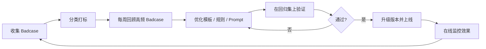

# Espressif ActionHub AI 技术架构文档

> 本文档覆盖 ActionHub 中所有 AI 能力的技术实现细节，包括：Workflow 设计、Agent 设计、Memory 设计、RAG 设计、MCP / 工具层设计、Skills 层设计、意图识别与路由、结构化抽取、Prompt 策略、模型选型、测试集构建、评测标准与 Badcase 优化闭环。  
> 产品层面的 AI 行为定义（状态体系、用户可见触发规则、能力边界）请参见 `PRD.md` 第 11 章；能力级执行规格请参见 `.output/AI-capability-spec.md`。

---

## 1. Workflow 设计

本系统是 workflow-driven system，AI 不是自治主体，而是关键节点上的受控增强层。

### 1.1 核心 workflow
1. `Teams / Outlook` 创建会议
2. 平台接入 meeting object
3. 会议结束后，主持人 / PM 指定主 transcript source
4. 触发 AI 结构化生成任务
5. 主持人 / PM 确认与编辑 AI 草稿
6. Outlook 生成并发送纪要邮件
7. Jira 任务创建
8. 沉淀到 Project History / Action Center

### 1.2 设计原则
- workflow 是主干，AI 只在结构化判断与建议路由节点生效
- 所有高影响写操作（发送邮件、创建 Jira）必须人工确认后触发
- AI 输出失败时保留 transcript 并允许人工回退

---

## 2. Agent 设计

ActionHub 中的 Agent 不是全链路自治 Agent，而是关键节点的受控编排者。

### 2.1 职责
- 根据会议类型选择模板和处理策略
- 将 transcript 组织成结构化结果
- 判断内容归属（decision、action item、risk、open question）
- 给出 action item 的路由建议
- Phase 2 做跨会议上下文串联与 follow-up 建议

### 2.2 不负责
- 自动替人做决策
- 自动发送高影响邮件
- 自动强制分派任务
- 自动创建未经确认的 Jira 事项

### 2.3 编排方式
- 任务型编排：单次会议的结构化生成按任务链依次调用
- Phase 2 引入跨任务上下文状态管理

---

## 3. Memory 设计

### 3.1 MVP
只做数据沉淀，不做强 memory 召回：

- 历史会议基本信息
- 纪要结构化结果
- action item 结果与状态
- 项目维度会议列表

特点：可查但不主动召回，不做跨会议自动关联。

### 3.2 Phase 2
升级为真正的上下文 memory：

- 上次会议纪要摘要召回（用于同项目下一次会议的上下文提示）
- 未完成 action item 自动带出（在新会议 AI 草稿中显示历史未关闭事项）
- 同一项目连续 blocker 识别（pattern-level memory）
- 不同会议模板偏好记忆（per-project 配置记忆）
- 常见 owner / 项目角色映射（提升 owner 识别准确率）

### 3.3 实现建议
- MVP：依赖 `History Store` 的 PostgreSQL 查询，不引入向量存储
- Phase 2：在 `History Store` 基础上增加轻量向量索引（用于摘要召回），单次会议 transcript 仍不做 RAG

---

## 4. RAG 设计

### 4.1 MVP
- 不做 RAG
- 只基于单次会议主 transcript 生成结构化结果
- 历史会议数据只做可查，不做自动召回

### 4.2 Phase 2
引入轻量 RAG，用途限定为：

- 召回同项目上次会议纪要摘要（作为上下文注入）
- 召回历史未完成 action item（作为续接提示）
- 召回项目背景信息（如已有项目简介文档）

### 4.3 技术方案
- 向量化目标：每次会议 summary + action items 摘要，不向量化完整 transcript
- 召回策略：按 `project_id` 限定范围，取最近 `N` 次（建议 3-5 次）
- 模型选择：优先使用轻量 embedding 模型（如 `text-embedding-3-small`）
- 存储：可在现有 PostgreSQL 基础上使用 `pgvector` 扩展，避免引入独立向量数据库

---

## 5. MCP / 工具层设计

本系统与外部系统的交互遵循 MCP 风格的资源与工具分层，明确读写边界。

### 5.1 工具层定义
| 工具 | 操作类型 | 描述 |
|------|----------|------|
| `teams_read_meeting` | 读 | 拉取 Teams 会议对象（标题、时间、参会人） |
| `outlook_read_calendar` | 读 | 读取 Outlook 日历中的会议事件 |
| `outlook_send_email` | 写（需人工确认） | 发送纪要邮件 |
| `jira_create_issue` | 写（需人工确认） | 创建 Jira issue |
| `jira_read_issue` | 读 | 读取 Jira issue 状态 |
| `ehr_notify` | 写（Phase 2，需人工确认） | 向 EHR 发送通知 / 待办路由 |
| `terminal_read_transcript` | 读 | 从会议室终端拉取 transcript |

### 5.2 设计原则
- 读操作可直接执行
- 写操作必须人工确认后触发
- 所有工具调用结果写入审计日志
- 工具调用失败时保留草稿并允许重试
- 后续可平滑迁移为标准 MCP 协议工具定义

### 5.3 Jira Cloud REST API v3：创建 Issue 字段（与产品映射）

官方入口：[Jira Cloud platform REST API v3 — Issues](https://developer.atlassian.com/cloud/jira/platform/rest/v3/api-group-issues/)（创建接口为 `POST /rest/api/3/issue`）。

**最小可创建 payload（绝大多数站点通用）**  
`fields` 内至少需要能唯一定位「项目 + 类型 + 标题」：

| API 字段 | 类型 | 说明 | ActionHub 产品侧对应 |
|----------|------|------|----------------------|
| `project` | `{ "key": "PROJ" }` 或 `{ "id": "..." }` | 目标项目 | 会议详情弹窗「项目 Key」、或项目配置默认值 |
| `issuetype` | `{ "name": "Task" }` 或 `{ "id": "..." }` | 工作项类型 | 弹窗「类型」；具体名称以站点配置为准 |
| `summary` | string | 单行标题，**必填** | 弹窗「摘要」，通常由 action item 标题预填、主持人可改 |

**常用可选字段（按站点与权限可能变为必填）**  

| API 字段 | 说明 | ActionHub 产品侧对应 |
|----------|------|----------------------|
| `description` | Jira Cloud 为 **Atlassian Document Format（ADF）** JSON，不是纯文本 | 弹窗内先按纯文本编辑，服务端再转换为 ADF 再调用 API |
| `assignee` | `{ "accountId": "..." }`（Cloud 推荐）；部分环境可用 `name`（已弃用/受限） | UI 展示「负责人（显示名）」；推送前由后端解析为 `accountId` |
| `duedate` | `YYYY-MM-DD` | 弹窗「截止日期」 |
| `labels` | string 数组 | 弹窗「标签」，逗号拆分为数组写入 API |
| `priority` | `{ "name": "High" }` 等 | 可按项目模板扩展，MVP 可省略 |

**发现「本站到底必填哪些字段」**  
同一 `project + issuetype` 在不同 Jira 上自定义字段差异很大，上线前应调用 **create meta**（如 `GET /rest/api/3/issue/createmeta` 等，以当前 Cloud 文档为准）拉取该组合下的 `required` 字段列表，再在 ActionHub 中做字段映射与表单校验。

**Data Center / Server**  
若部署为 Jira Server/Data Center，REST 路径与版本不同，且 `description` 历史上曾支持纯字符串；以对应版本的 [Jira Server REST 文档](https://developer.atlassian.com/server/jira/platform/rest-apis/) 为准，与 Cloud 分支维护两套适配层更安全。

### 5.4 Microsoft Graph：发送邮件（sendMail，与产品映射）

官方入口：[user: sendMail](https://learn.microsoft.com/en-us/graph/api/user-sendmail?view=graph-rest-1.0)。发送前建议阅读 [Outlook 中发送邮件的注意事项](https://learn.microsoft.com/en-us/graph/outlook-things-to-know-about-send-mail)。

**HTTP**  
`POST https://graph.microsoft.com/v1.0/me/sendMail`  
或 `POST .../users/{id | userPrincipalName}/sendMail`（应用代表用户发送时需指定邮箱用户）。

**权限（最小特权）**  
委托/应用均为 **`Mail.Send`**（见文档 Permissions 表）。

**请求体（JSON）**  

| 参数 | 类型 | 说明 |
|------|------|------|
| `message` | [Message](https://learn.microsoft.com/en-us/graph/api/resources/message?view=graph-rest-1.0) | **必填**。`subject`、`body`（`contentType`: `Text` 或 `HTML`、`content`）、`toRecipients` / `ccRecipients`（`emailAddress.address`）等 |
| `saveToSentItems` | Boolean | 可选；默认 `true` 写入「已发送邮件」；仅在为 `false` 时需在 body 中显式传入 |

**与 ActionHub 会议详情右栏的对应关系**  

| 产品 UI（弹窗/卡片） | Graph `message` 字段 |
|----------------------|----------------------|
| 收件人 / 抄送 | `toRecipients[]` / `ccRecipients[]` |
| 主题 | `subject` |
| 正文 | `body`（产品可先编辑纯文本/HTML，再映射；复杂排版需与 Exchange 限制对齐） |
| 附件（若后续扩展） | 可在同一调用中带 [fileAttachment](https://learn.microsoft.com/en-us/graph/api/resources/fileattachment?view=graph-rest-1.0)（`contentBytes` Base64） |

**响应与可靠性**  
成功返回 **`202 Accepted`**，仅表示请求已被接受，**不保证**投递已完成；投递受 [Exchange Online 限制与节流](https://learn.microsoft.com/en-us/office365/servicedescriptions/exchange-online-service-description/exchange-online-limits) 约束。产品侧应：**幂等键 / 重试策略**、**审计 `sent_at` 与 Graph 响应**、失败保留草稿。

**替代路径**  
可先 `POST /me/messages` 创建草稿再发送（适合「仅保存草稿、稍后发」）；与当前原型「推送即发送」可二选一或并存。

---

## 6. Skills 层设计

Phase 2 在基础 AI 模块之上增加一层 `AI Skills Layer`，把用户真正感知的能力封装成可复用、可运营、可灰度发布的场景技能。

### 6.1 Skills 定义
Skill 不是新的底层模型，而是由 `输入契约 + 召回上下文 + Prompt / 规则 + 输出 schema + UI 触发方式 + 反馈闭环` 组成的能力包。

### 6.2 首批 Skills
| Skill | 主要页面 | 输入 | 输出 | 是否可直接写下游 |
|------|----------|------|------|------------------|
| `Management Summary Skill` | `Meeting Detail` | 已确认纪要 + transcript 摘要 | 管理层摘要 | 否 |
| `Action Focus Skill` | `Meeting Detail` / `Action Center` | action items + evidence | 行动项聚焦视图 | 否 |
| `Cross-meeting Follow-up Skill` | `Action Center` | 当前事项 + 历史未关闭事项 | follow-up 建议 | 否 |
| `Blocker Scan Skill` | `Action Center` / `AI Ops` | 风险 / blocker 数据 | blocker 趋势与升级建议 | 否 |
| `Routing Suggestion Skill` | `Meeting Detail` | action item + 项目配置 | Jira / EHR / Email only 建议 | 否 |

### 6.3 触发与治理
- 页面上下文做弱推荐，用户手动触发优先
- 每个 Skill 单独配置开关、版本号、灰度范围
- `AI Ops` 负责查看 Skill 的采用率、失败率、badcase 与回归状态
- Skill 输出保留 `skill_name`、`skill_version`、`source_excerpt`、`feedback_label`

---

## 7. 意图识别与任务路由

### 7.1 MVP 意图分类

#### 会议类型意图
- 项目周会
- 技术评审会
- 风险同步会

#### 输出目标意图
- 生成完整纪要
- 生成 Outlook 邮件草稿
- 生成 Jira 任务草稿
- 调用场景化 Skill
- 查看项目历史会议

#### 路由意图
- Jira
- EHR（预留）
- Email only

### 7.2 路由逻辑
- 项目周会 → 周会模板 → 重点提取 action items 与进展
- 技术评审会 → 评审模板 → 重点提取 decisions 与 risks
- 风险同步会 → 风险模板 → 重点提取 blockers 与 open questions
- 勾选 Jira → action items 进入 Jira draft 流程
- 勾选 EHR → Phase 2 落地

### 7.3 Phase 2 扩展意图
- 全员纪要版
- 管理层摘要版
- 行动项聚焦版
- blocker 聚焦版
- HR 通知版
- 跨会议 follow-up 建议
- 风险升级建议

---

## 8. 结构化抽取设计

### 8.1 Decision 抽取
- 定义：提取明确达成一致的结论
- 原则：必须有明确结论性表达，不把普通讨论或建议误判为 decision，未决内容进入 open question
- 输出字段：`decision_text`、`source_excerpt`、`confidence_score`

### 8.2 Action Item 抽取
- 定义：提取明确后续动作
- 原则：必须是可执行事项，尽量抽取 owner 和 deadline，抽不到允许留空，模糊任务进入 `needs_review`
- 输出字段：`title`、`description`、`owner`、`deadline`、`source_excerpt`、`routing_suggestion`、`confidence_score`、`review_status`

### 8.3 Risk / Blocker 抽取
- 定义：提取明确风险、阻塞项、依赖问题
- 原则：只提取影响后续推进的问题，不把一般讨论或抱怨误判为 blocker
- 输出字段：`risk_text`、`source_excerpt`、`confidence_score`

### 8.4 Open Question 抽取
- 定义：提取未决、待确认、待补充的问题
- 原则：没有形成结论，仍需补充信息或等待决定，不误归入 decision
- 输出字段：`question_text`、`related_owner`、`source_excerpt`、`confidence_score`

### 8.5 Owner / Deadline 识别
- 原则：只在 transcript 有足够依据时抽取，不强行补全
- deadline 无法确定时允许留空
- 低置信度必须展示为 `needs_review`
- 回退机制：owner 为空 → 人工补充；deadline 为空 → 人工补充；多 owner 模糊 → 不自动指定唯一 owner

---

## 9. Prompt 策略与输出约束

### 9.1 Prompt 分层
| 层级 | 用途 | 说明 |
|------|------|------|
| 系统级 Prompt | 定义产品边界、输出原则、禁止行为 | 所有会议类型共用 |
| 会议类型模板 Prompt | 项目周会 / 技术评审会 / 风险同步会 | 按会议类型切换 |
| 任务型 Prompt | 纪要生成、action item 抽取、risk 提取、email draft 生成 | 按输出目标调用 |
| 路由型 Prompt | 判断 action item 更适合 Jira / EHR / email only | 轻量，可用规则辅助 |

### 9.2 输出约束
- 必须输出固定 schema（JSON 结构化输出）
- `owner / deadline` 抽不到时允许留空，不允许幻觉填充
- 讨论内容不能强行写成决议
- 低置信度 action item 必须标记 `needs_review`
- 不允许自动生成 transcript 中没有文本依据的强结论
- 所有输出必须附带 `source_excerpt`（来源文本片段）

### 9.3 版本管理
- 不同会议类型使用不同模板版本号（如 `weekly_v1.2`）
- Prompt 升级时必须记录版本号与变更原因
- Badcase 修复后做回归测试，通过后更新版本号并记录

---

## 10. 模型选型原则

| 能力 | 推荐方向 | 说明 |
|------|----------|------|
| ASR / 转写 | 成熟商用 ASR 服务 | 不自研底层声学模型，优先稳定可用的云端 ASR |
| 纪要结构化生成 | 长上下文生成模型 | 需支持 `32k+` 上下文以处理完整 transcript |
| 结构化抽取 | Schema constrained output 或 JSON mode | 优先使用模型原生 JSON 输出能力，避免后处理解析 |
| 路由建议 | 轻量 prompt + 规则组合 | 不需要大模型，规则优先，必要时辅以分类模型 |
| Skills 编排 | 工作流编排 + 规则路由 + 轻量模型组合 | 优先复用已有模块，避免为每个 Skill 单独造模型 |
| 跨会议召回（Phase 2） | 轻量 embedding 模型 + pgvector | 优先用已有 PostgreSQL 扩展，避免独立向量数据库 |

### 10.1 选型原则
- 优先稳定可用，优先可控可审计
- MVP 阶段避免引入过重模型复杂度
- 外部模型调用必须有 fallback 和错误日志
- 不使用用于网络请求的客户端（如 `httpx / openai`）继承环境变量，需显式传入配置

---

## 11. 测试数据集构建

### 11.1 数据来源
- 历史会议 transcript（脱敏处理后使用）
- 人工撰写的纪要
- Outlook 纪要邮件
- Jira 任务记录

### 11.2 样本类型
- 项目周会样本
- 技术评审会样本
- 风险同步会样本

### 11.3 标注维度
- Summary 可用性（语义准确、无幻觉）
- Decision 提取（是否正确识别结论性表达）
- Action Item 提取（是否完整、是否误提）
- Owner / Deadline 抽取（是否有足够依据才抽取）
- Risk / Blocker 识别（是否只提取真正影响推进的问题）
- Open Question 识别（是否正确区分未决内容）

### 11.4 数据集划分
| 子集 | 用途 |
|------|------|
| 开发集 | 日常调试与 prompt 迭代 |
| 验证集 | 模板版本升级前的效果评估 |
| Badcase 回归集 | 修复的 badcase 回归验证，只增不减 |

---

## 12. 评测维度与验收标准

### 12.1 离线评测
| 指标 | 说明 |
|------|------|
| Decision 提取准确率 | 正确 decision 数 / 人工标注 decision 总数 |
| Action item 提取召回率 | 被提取 action item 数 / 人工标注 action item 总数 |
| Action item 精确率 | 正确 action item 数 / 模型提取 action item 数 |
| Owner 抽取准确率 | 正确 owner 数 / 有明确 owner 的 action item 数 |
| Deadline 抽取准确率 | 正确 deadline 数 / 有明确 deadline 的 action item 数 |
| Blocker 识别准确率 | 正确 blocker 数 / 人工标注 blocker 总数 |
| Open Question 召回率 | 被识别的 open question 数 / 人工标注总数 |

### 12.2 在线业务指标
（与 `PRD.md` 第 4.2 节成功指标对齐）

| 指标 | 工程采集方式 |
|------|------------|
| AI 草稿采用率 | 统计 `minutes_confirmed` 中未重新生成的占比 |
| Action item 提取采纳率 | `review_status = confirmed` 的数量 / 模型提取总数 |
| Skill 触发采用率 | 触发后被保留或复制使用的 Skill 输出数 / Skill 总触发数 |
| Skill 失败率 | Skill 运行失败数 / Skill 总触发数 |
| Owner / deadline 改写占比 | `action_item_change_logs` 中涉及 owner / deadline 的记录占比 |
| Badcase 回归通过率 | `badcase_regression_runs` 通过数 / 回归集总数 |

---

## 13. Badcase 收集与优化流程

### 13.1 Badcase 类型
| 类型 | 描述 |
|------|------|
| ASR 错误导致纪要偏差 | transcript 本身质量问题引发的下游误差 |
| Decision 误提 | 把讨论、建议误判为决议 |
| Action item 漏提 | 有明确任务但 AI 未提取 |
| Owner 识别错误 | 错误归属 owner |
| Deadline 幻觉 | transcript 中无明确依据时 AI 自行填充 deadline |
| 闲聊内容误入纪要 | 将非业务内容误判为有效输出 |
| Risk / Blocker 漏识别 | 有明确 blocker 但未提取 |

### 13.2 收集入口
- 主持人 / PM 在 `Meeting Detail` 手动标记反馈
- 编辑操作反推（大幅修改 AI 草稿视为潜在 badcase）
- 邮件发送前的删除 / 改写记录
- Jira 创建前的丢弃记录
- Phase 2 的 `AI Ops` 页面集中管理

### 13.3 优化闭环

### 13.4 版本升级规则
- 每次 prompt 或模板修改必须触发回归测试
- 回归通过率 `>= 90%` 才允许升级版本
- 升级后需观察在线指标 `3-5` 个工作日，确认无回退再关闭 badcase
