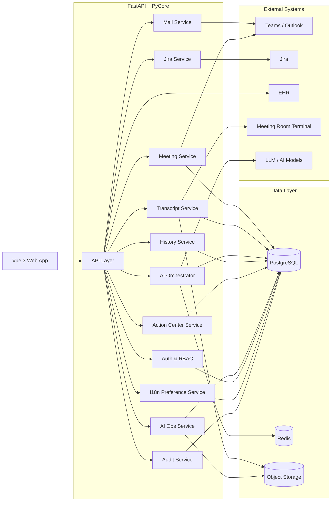
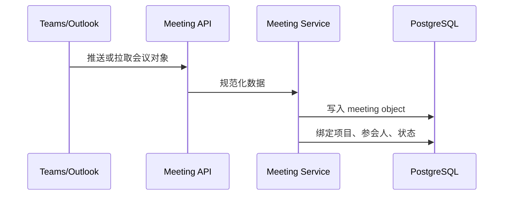
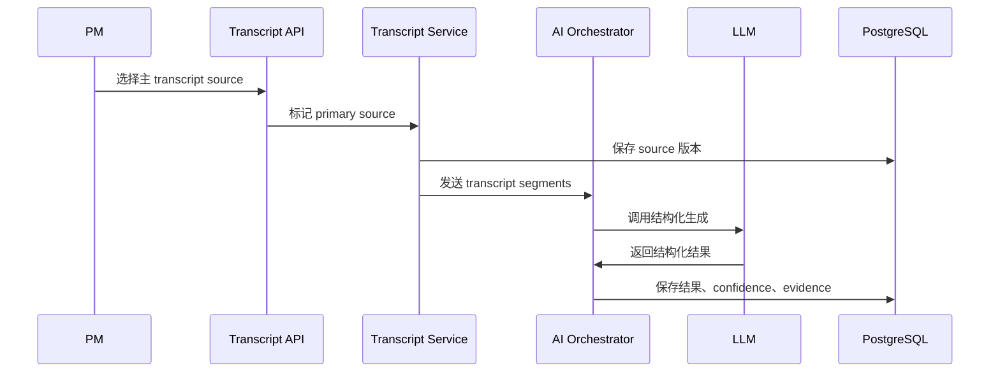
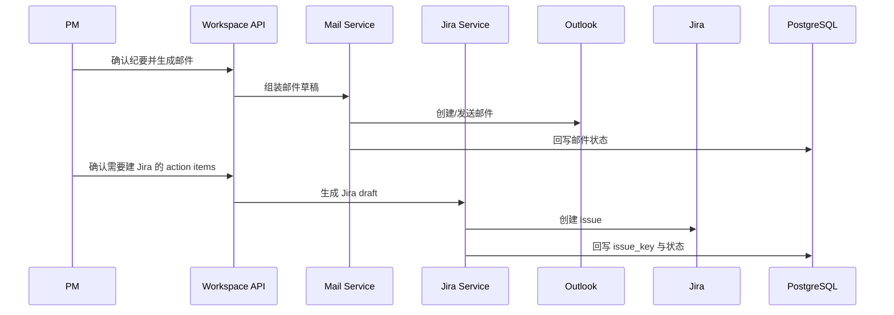

# Espressif ActionHub 架构蓝图

## 1. 架构目标
本架构服务于一个以会议结果处理为核心的企业协同系统。目标不是做全自治 Agent，而是在 `workflow` 主干上，用可控的 AI 能力完成结构化提取、建议路由、跨会议追踪和持续优化。

架构必须满足：
- 前端工作台清晰，支持 9 个页面协同
- 后端链路可审计、可回放、可重试
- 外部系统写操作必须人工确认
- AI 输出必须能关联 evidence 和 confidence
- Phase 2 能平滑接入 `Action Center` 与 `AI Ops`

## 2. 固定技术栈
### 前端
- `Vue 3`
- `TypeScript`

### 后端
- `Python 3.11+`
- `FastAPI`
- `PyCore`

### 存储与基础设施
- `PostgreSQL`：核心业务数据
- `Redis`：缓存、短期状态、异步任务协作
- 对象存储：原始 transcript 文件、导出内容、回归样本附件

### 外部系统
- `Teams / Outlook`
- `Jira`
- `EHR`
- 会议室终端 transcript source

### AI 层
- 长上下文生成模型：用于纪要生成与邮件草稿
- 结构化抽取链路：用于 decisions、action items、risks、open questions、owner、deadline 提取
- 模板与 prompt 版本管理

## 3. 逻辑架构

## 4. 模块拆分
### 4.1 API Layer
职责：
- 提供前端统一 API
- 处理鉴权、参数校验、错误响应
- 聚合多个服务结果返回工作台

### 4.2 Auth & RBAC
职责：
- 用户身份校验
- 角色权限控制：PM、Tech Lead、Participant、Admin
- 页面级与操作级鉴权

### 4.3 Meeting Service
职责：
- 同步 `Teams / Outlook` 会议对象
- 生成内部 `meeting_id`
- 维护会议基础信息、参会人、项目归属、状态

### 4.4 Transcript Service
职责：
- 读取会议室终端或 Teams transcript
- 维护 transcript source 元数据
- 标记主 transcript source
- 保存 transcript segments、版本与来源

### 4.5 AI Orchestrator
职责：
- 根据会议类型选择模板
- 调用结构化抽取与生成能力
- 产出 `Summary`、`Decisions`、`Action Items`、`Risks / Blockers`、`Open Questions`
- 生成 evidence、confidence、routing suggestion
- 记录 prompt/template/model 版本

### 4.6 Mail Service
职责：
- 根据确认后的纪要生成 Outlook 邮件草稿
- 执行发送（对接 **Microsoft Graph** [`sendMail`](https://learn.microsoft.com/en-us/graph/api/user-sendmail?view=graph-rest-1.0)，权限 `Mail.Send`；成功为 `202 Accepted`，需按 Exchange 节流做重试与审计，字段映射见 `AI-architecture.md` 5.4）
- 回写发送状态

### 4.7 Jira Service
职责：
- 根据确认后的 action items 生成 Jira draft
- 映射 Jira 必填字段（Cloud 最小集：`project` + `issuetype` + `summary`；`description` 转 ADF；`assignee` 解析为 `accountId`；详见 `AI-architecture.md` 5.3）
- 对目标 `project + issuetype` 拉取 create meta，校验本站自定义必填项
- 创建 issue 并回写 `issue_key`

### 4.8 History Service
职责：
- 按项目沉淀历史会议
- 保存纪要、邮件、Jira 结果
- 为 `Project History` 查询提供统一视图

### 4.9 Action Center Service
职责：
- 聚合所有项目 action items
- 识别逾期项、待补 owner / deadline、跨会议未关闭项
- 提供表格与 KPI 数据源

### 4.10 AI Ops Service
职责：
- 管理 badcase
- 维护模块级指标
- 统计 owner / deadline / extraction 效果
- 支持回归验证与优化建议

### 4.11 I18n Preference Service
职责：
- 维护用户语言偏好
- 给前端提供 `中 / EN` 文案切换依据

### 4.12 Audit Service
职责：
- 记录高影响操作日志
- 支持审计、回放与问题追踪

## 5. 核心数据对象
### 5.1 Meeting
- `meeting_id`
- `calendar_event_id`
- `title`
- `meeting_type`
- `project_id`
- `organizer_id`
- `participants`
- `meeting_source`
- `status`

### 5.2 TranscriptSource
- `meeting_id`
- `source_type`
- `source_id`
- `is_primary`
- `selected_by`
- `selected_at`
- `transcript_version`

### 5.3 StructuredMinutes
- `meeting_id`
- `summary`
- `decisions`
- `action_items`
- `risks_blockers`
- `open_questions`
- `confidence_score`
- `template_version`
- `model_version`

### 5.4 ActionItem
- `action_item_id`
- `meeting_id`
- `title`
- `description`
- `owner_name`
- `deadline`
- `review_status`
- `routing_suggestion`
- `final_routing`
- `jira_issue_key`
- `source_excerpt`

### 5.5 Badcase
- `badcase_id`
- `meeting_id`
- `module_name`
- `badcase_type`
- `raw_input_ref`
- `expected_output`
- `actual_output`
- `status`
- `resolved_at`

## 6. 关键调用链
### 6.1 会议接入链

### 6.2 纪要生成链

### 6.3 邮件与 Jira 流转链

## 7. 前端页面架构
### 7.1 页面分层
- `AppShell`：左侧导航 + 顶部导航 + 全局语言切换
- `DashboardView`
- `MeetingsView`
- `MeetingDetailView`
- `MyActionItemsView`
- `ProjectHistoryView`
- `TemplatesRulesView`
- `IntegrationsAdminView`
- `ActionCenterView`
- `AIOpsView`

### 7.2 前端状态建议
- 页面数据：按页面分模块管理
- 高频筛选条件：保留在 URL query
- 用户偏好：语言、项目上下文、表格列偏好持久化
- 大对象详情：懒加载

## 8. 后端 API 边界
### 8.1 会议与详情
- `GET /meetings`
- `GET /meetings/{meeting_id}`
- `POST /meetings/{meeting_id}/primary-source`

### 8.2 AI 结果与确认
- `POST /meetings/{meeting_id}/ai/generate`
- `PATCH /meetings/{meeting_id}/minutes`
- `POST /meetings/{meeting_id}/confirm`

### 8.3 邮件与 Jira
- `POST /meetings/{meeting_id}/email-draft`
- `POST /meetings/{meeting_id}/email-send`
- `POST /meetings/{meeting_id}/jira-draft`
- `POST /meetings/{meeting_id}/jira-create`

### 8.4 历史与任务中心
- `GET /projects/{project_id}/history`
- `GET /action-center/items`
- `PATCH /action-center/items/{action_item_id}`

### 8.5 AI Ops
- `GET /ai-ops/metrics`
- `GET /ai-ops/badcases`
- `POST /ai-ops/badcases`
- `PATCH /ai-ops/badcases/{badcase_id}`

### 8.6 用户偏好
- `GET /me/preferences`
- `PATCH /me/preferences/language`

## 9. 异步任务与状态机
### 9.1 建议异步任务
- 会议同步
- Transcript 拉取与解析
- AI 结构化生成
- 邮件草稿生成
- Jira draft 生成
- 指标聚合
- Badcase 回归任务

### 9.2 会议状态机
`scheduled -> in_progress -> ended -> ai_draft_generated -> reviewed -> emailed -> jira_synced`

说明：
- 若邮件或 Jira 写入失败，保留失败状态并允许重试，不回退已确认纪要。

## 10. 权限与审计
### 10.1 权限控制
- 主持人 / PM：可编辑 Meeting Detail、发送邮件、创建 Jira
- Tech Lead：可查看和补充信息
- Participant：只读会议结果和与自己相关任务
- Admin：可维护模板、集成、AI Ops

### 10.2 审计事件
- 主 transcript source 选择
- 纪要确认与编辑
- 邮件发送
- Jira 创建
- 模板修改
- 路由规则修改
- Badcase 状态变更
- 语言偏好修改

## 11. 指标采集方案
### 11.1 采集原则
- 业务指标优先基于服务端事件和状态变更计算，不依赖纯前端埋点。
- 前端埋点用于补充页面访问、点击、筛选、语言切换等行为数据。
- 所有核心指标都需要能追溯到 `meeting_id`、`action_item_id`、`project_id`、`user_id`。
- 指标口径统一由后端聚合任务产出，避免页面各自重复计算。

### 11.2 核心事件
- `meeting_synced`
- `primary_transcript_selected`
- `ai_minutes_generated`
- `minutes_confirmed`
- `email_draft_generated`
- `email_sent`
- `jira_draft_generated`
- `jira_issue_created`
- `project_history_viewed`
- `action_item_confirmed`
- `action_item_owner_updated`
- `action_item_deadline_updated`
- `cross_meeting_followup_detected`
- `blocker_pattern_detected`
- `badcase_created`
- `badcase_resolved`
- `language_switched`

### 11.3 指标与数据来源映射
| 指标 | 计算方式 | 主要来源 |
|------|----------|----------|
| 会后纪要整理中位时长 | `minutes_confirmed_at - meeting_ended_at` 的中位数 | `meetings` 表 + 审计事件 |
| Outlook 纪要发送中位时延 | `email_sent_at - minutes_confirmed_at` 的中位数 | `email_drafts` 表 + 审计事件 |
| AI 草稿采用率 | 在 AI 草稿基础上完成确认的会议数 / 已生成 AI 草稿会议数 | `structured_minutes` 表 |
| Action item 提取采纳率 | 被保留并进入确认流的 action item 数 / AI 提取 action item 总数 | `action_items` 表 |
| Jira 草稿转正式任务率 | 已创建 Jira issue 数 / 已生成 Jira draft 数 | `jira_sync_records` 表 |
| Project History 周活查看率 | 周内访问过历史页的用户数 / 试点用户总数 | 前端埋点 + `page_view_events` |
| 跨会议未完成事项跟进率 | 被重新识别并更新状态的跨会议事项数 / 跨会议未完成事项总数 | `action_center_snapshots` 表 |
| 连续 blocker 识别命中率 | 用户确认有效的 blocker pattern 数 / 系统提示的 pattern 数 | `ai_detection_feedback` 表 |
| Owner / deadline 改写占比 | 发生 owner 或 deadline 人工修改的 action item 数 / 已确认 action item 总数 | `action_item_change_logs` 表 |
| AI Ops 闭环时效 | `badcase_resolved_at - badcase_created_at` 的中位数 | `badcases` 表 |
| Badcase 回归通过率 | 回归通过 badcase 数 / 纳入回归集 badcase 数 | `badcase_regression_runs` 表 |

### 11.4 建议数据表
- `page_view_events`
- `audit_events`
- `action_item_change_logs`
- `ai_detection_feedback`
- `action_center_snapshots`
- `badcase_regression_runs`
- `metric_daily_aggregates`

### 11.5 聚合任务建议
- 每小时增量聚合核心业务漏斗
- 每天生成项目级、用户级、模块级指标快照
- 每周生成试点项目 KPI 周报
- AI Ops 回归任务完成后自动刷新模块级质量指标

## 12. 风险点与治理
| 风险点 | 表现 | 架构治理方式 |
|--------|------|--------------|
| Transcript 质量不稳定 | AI 输出波动 | 保留来源、版本、evidence 与人工修正入口 |
| Prompt 版本漂移 | 同类型会议输出不一致 | 模板版本管理 + 回归集 |
| 外部系统失败 | 邮件/Jira 写入失败 | 幂等写入 + 重试 + 审计 |
| 页面数据过重 | Meeting Detail 性能下降 | 分块加载、异步拉取、缓存 |
| Phase 2 聚合口径不一致 | Action Center 指标不可信 | 建立统一 action item 状态口径 |

## 13. 演进建议
### 13.1 短期
- 先把会议对象、纪要确认、邮件发送、Jira 建单链路做稳
- 保证 evidence 与 confidence 全链路可见

### 13.2 中期
- 完善 Action Center 聚合逻辑
- 建立 AI Ops badcase 分类、修复、回归机制

### 13.3 长期
- 引入历史会议轻量召回
- 引入更细粒度的模块评测体系
- 逐步扩展多 transcript source 融合与组织级分析能力
