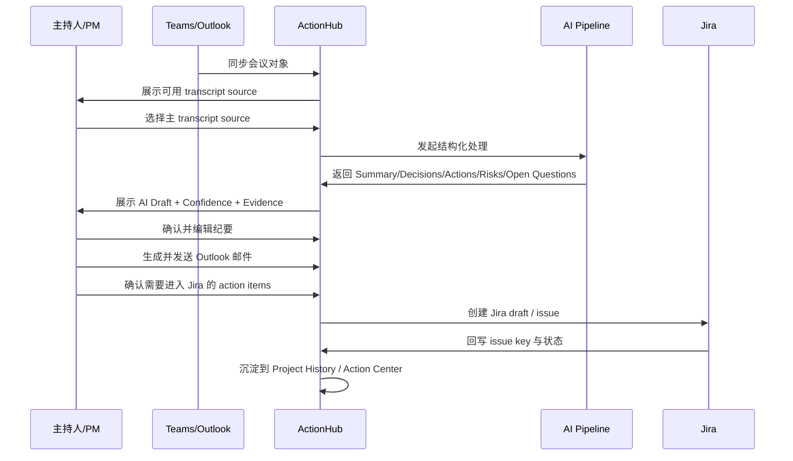
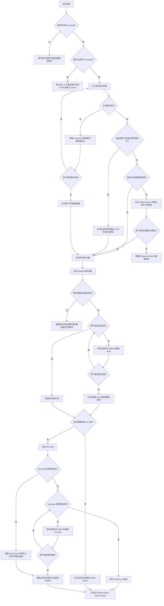
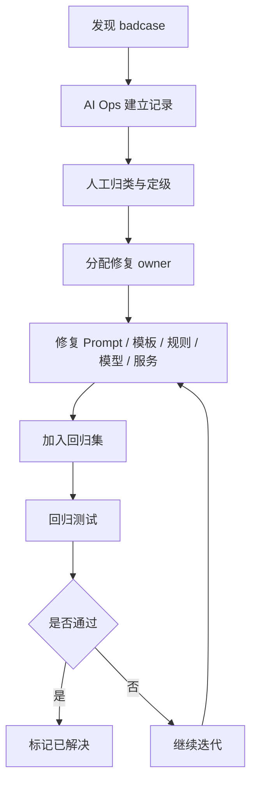

# Espressif ActionHub PRD

## 1. 摘要
Espressif ActionHub 是一个面向内部混合会议场景的会议结果协同平台。它连接 `Teams`、`Outlook`、会议室终端、`Jira` 与 `EHR`，把“会后人工整理纪要、手动抄任务、历史会议割裂”的流程，升级为“结构化纪要、人工确认、任务流转、历史追踪、持续优化”的闭环。

本版本 PRD 以已确认原型为准，覆盖 9 个页面：`Dashboard`、`Meetings`、`Meeting Detail`、`My Action Items`、`Project History`、`Templates & Rules`、`Integrations & Admin`、`Action Center`、`AI Ops`。全局采用 `Modern Enterprise Collaboration UI` 风格，并在顶部导航提供 `中 / EN` 语言切换。

---

## 2. 项目背景、问题与产品定位

### 2.1 背景与问题
当前内部混合会议依赖 `Teams / Outlook` 订会，线下会议室和线上参会并存。会议结束后通常要人工整理纪要，再通过 Outlook 发送，并把 action items 手动录入 Jira。该流程有 4 个核心问题：

1. 纪要整理耗时高。
2. Action items 纯手动创建，容易遗漏。
3. 历史会议无法按项目连续沉淀。
4. 录音、录屏与后续推进没有形成可执行闭环。

### 2.2 产品定位
ActionHub 不是替代 `Teams` 的会议工具，而是在现有会议基础设施之上，增加一层会后结构化处理、人工确认、邮件同步、任务流转与持续优化能力。

### 2.3 设计原则
1. `workflow` 是主干，AI 是受控增强，不是黑箱自动化。
2. 高影响动作必须保留人工确认。
3. 先展示结论，再展示原始 transcript。
4. AI 内容必须显式展示 `AI Draft`、`Needs Review`、`Confirmed`、`Confidence`。
5. Phase 2 能力增强主流程，但不能压垮 MVP 工作台。

---

## 3. 用户角色与协作对象

| 角色 | 主要目标 | 核心操作 |
|------|----------|----------|
| 项目经理 / PM | 快速完成纪要确认、任务分派、邮件发送、Jira 建单 | 选择 transcript、确认 AI 草稿、发送邮件、同步 Jira |
| 研发负责人 / Tech Lead | 快速抓住决议、风险、阻塞项和后续动作 | 查看会议结果、补充 owner / deadline、确认 blocker |
| 参会成员 | 明确自己要做什么，能快速回看背景 | 查看纪要邮件、查看与自己有关的 action item、回看历史会议 |
| 管理员 | 维护模板、规则、集成状态和优化配置 | 配置模板、测试连接、查看日志、处理 badcase |

---

## 4. 产品目标、成功指标与版本范围

### 4.1 业务目标
1. 显著减少会后纪要整理时间。
2. 降低 action item 漏提和漏同步概率。
3. 让会议结果可确认、可编辑、可发送、可建单、可追踪。
4. 为后续 AI 能力模块化沉淀统一输入输出与 badcase 优化闭环。

### 4.2 成功指标
以下指标默认以试点项目为统计范围，统计周期为连续 `8-12` 周。若正式上线前拿不到历史基线，则先以试点首 `2` 周数据作为基线。

#### MVP / Phase 1
| 指标 | 统计口径 | 基线 | 目标 |
|------|----------|------|------|
| 会后纪要整理中位时长 | 从会议结束到主持人完成纪要确认的中位时长 | `30` 分钟 | 降到 `15` 分钟以内 |
| Outlook 纪要发送中位时延 | 从纪要确认完成到邮件成功发送的中位时长 | `20` 分钟 | 降到 `5` 分钟以内 |
| AI 草稿采用率 | 直接在 AI 草稿上编辑并发送的会议数 / 已生成 AI 草稿的会议数 | `0%` | 达到 `>= 70%` |
| Action item 提取采纳率 | 被用户保留并进入确认流的 action items / AI 提取 action items 总数 | `0%` | 达到 `>= 80%` |
| Jira 草稿转正式任务率 | 成功创建 Jira issue 的 action items / 已生成 Jira draft 的 action items | `0%` | 达到 `>= 60%` |
| Project History 周活查看率 | 每周至少查看 1 次项目历史页的试点用户数 / 试点用户总数 | `0%` | 达到 `>= 40%` |

#### Phase 2
| 指标 | 统计口径 | 基线 | 目标 |
|------|----------|------|------|
| 跨会议未完成事项跟进率 | 在连续两次会议中被重新识别并更新状态的未完成事项数 / 跨会议未完成事项总数 | `0%` | 达到 `>= 65%` |
| 连续 blocker 识别命中率 | 被用户确认“识别正确”的连续 blocker 提示数 / 连续 blocker 提示总数 | `0%` | 达到 `>= 75%` |
| Owner / deadline 纠错率下降 | 需要人工改写 owner 或 deadline 的 action items / 已确认 action items 总数 | `35%` | 降到 `<= 15%` |
| AI Ops 闭环时效 | 从 badcase 创建到状态变为已解决的中位耗时 | `无基线` | 控制在 `7` 天以内 |
| 模块级 badcase 回归通过率 | 修复后回归通过的 badcase 数 / 纳入回归集的 badcase 总数 | `0%` | 达到 `>= 90%` |

### 4.3 版本范围与优先级
| 模块 | MVP | Phase 1 | Phase 2 |
|------|-----|---------|---------|
| 会议对象接入 | P0 | 持续稳定 | 持续稳定 |
| 主 transcript 选择 | P0 | P0 | P0 |
| AI 结构化纪要 | P0 | P0 | 模块化增强 |
| Outlook 邮件草稿与发送 | P0 | P0 | P0 |
| Jira 草稿与创建 | 预留/轻展示 | P0 | P0 |
| My Action Items | 轻入口 | P0 | P0 |
| Project History | P0 | P0 | 跨会议增强 |
| Templates & Rules | P1 | P1 | 模块化配置中心 |
| Integrations & Admin | P1 | P1 | P1 |
| Action Center | - | 轻能力前置 | P0 |
| AI Ops | - | - | P0 |
| AI Skills | - | - | P0 |
| EHR 路由 | 预留 | 预留 | P1 |
| 中 / EN 切换 | P1 | P1 | P1 |

---

## 5. 产品架构与系统分层设计

### 5.1 总体分层架构
ActionHub 在系统架构上分为 6 层：

1. **前台体验层**  
   承载 `Dashboard`、`Meetings`、`Meeting Detail`、`My Action Items`、`Project History` 等用户可见页面，负责会后结果确认、历史回看、任务查看和 AI 结果消费。

2. **后台运营层**  
   承载 `Templates & Rules`、`Integrations & Admin`、`Action Center`、`AI Ops` 等运营与管理员页面，负责模板、规则、集成状态、任务闭环和 badcase 优化。

3. **Workflow 编排层**  
   负责按顺序编排 transcript 选择、会议类型识别、结构化纪要生成、action item 抽取、owner / deadline 识别、routing suggestion、邮件草稿生成、Jira draft 生成、AI Ops 回流等节点。

4. **AI 能力层**  
   负责分类、抽取、生成、归因和回归评估等模型调用。产品层不暴露具体模型，但节点级职责必须清晰可控。

5. **业务服务层**  
   负责 `Meeting Ingestion`、`Transcript Manager`、`Mail Composer`、`Jira Router`、`History Store`、`Action Center Engine`、`AI Ops Console` 等服务能力。

6. **数据与知识层**  
   负责会议对象、transcript、结构化结果、邮件记录、Jira 记录、模板配置、规则配置、badcase、回归集、评测集和日志留存。

### 5.2 系统主数据流
主数据流如下：

- `Teams / Outlook / Terminal` -> 会议对象写入 -> 选择主 transcript -> AI 结构化处理 -> 用户确认 -> 邮件发送 / Jira 创建 -> 历史沉淀 -> `Action Center` -> `AI Ops`
- 反馈流：用户编辑、用户丢弃、邮件失败、Jira 失败、AI 低置信度、管理员标注 badcase -> `AI Ops`
- 配置流：模板、规则、集成状态、权限配置 -> Workflow 编排层 -> 影响前台处理效果

### 5.3 模块边界
- `Meeting Ingestion` 只负责会议对象接入，不负责 AI 处理。
- `Transcript Manager` 只负责 source 管理、版本管理与 evidence 索引。
- `AI Orchestrator` 只负责受控调用模型与规则，不直接写入外部系统。
- `Mail Composer` 与 `Jira Router` 都是高影响动作服务，必须以人工确认结果为输入。
- `Action Center` 只做跨会议任务聚合与 follow-up 洞察，不替代单场会议工作台。
- `AI Ops` 只做问题可视化、归因、修复追踪和回归，不直接参与用户主流程。

### 5.4 架构设计原则
- 用户确认前，所有 AI 结果都只是 `AI Draft` 或 `Needs Review`
- Workflow 层明确先后顺序，避免页面直接绕过关键校验节点
- 低风险动作可自动完成，高影响动作必须人工确认
- 所有关键对象要支持 audit trail 和版本追踪
- Phase 2 增强能力必须以不破坏 MVP 主工作台为前提

### 5.5 组件交互说明
#### 影响模块
- `Meeting Ingestion`：接收 `Teams / Outlook` 会议对象。
- `Transcript Manager`：管理 transcript source、分段和版本。
- `AI Orchestrator`：调用模板、模型、抽取器和路由建议。
- `Minutes Workspace`：承载 `Meeting Detail` 的确认与编辑。
- `Mail Composer`：生成和发送 Outlook 邮件草稿。
- `Jira Router`：生成 Jira draft、创建 issue、回写状态。
- `History Store`：沉淀项目历史记录。
- `Action Center Engine`：聚合跨会议 action items。
- `AI Skills Layer`：按页面上下文封装可复用 Skill，统一输入输出与触发方式。
- `AI Ops Console`：管理 badcase、模块指标、Skill 版本和回归。
- `I18n Layer`：管理 `中 / EN` 文案切换。

#### 调用关系
1. `Meeting Ingestion` 写入会议对象。
2. `Transcript Manager` 绑定主 source 并触发 `AI Orchestrator`。
3. `AI Orchestrator` 输出结构化结果给 `Minutes Workspace`。
4. 用户确认后，`Minutes Workspace` 调用 `Mail Composer` 与 `Jira Router`。
5. `Mail Composer`、`Jira Router` 的结果回写 `History Store`。
6. `History Store` 为 `Project History`、`Action Center`、`AI Ops Console` 提供查询与分析基础。

---

## 6. 数据契约与核心对象

### 6.1 用户角色
- `host_pm`
- `tech_lead`
- `participant`
- `admin`

### 6.2 会议对象
- `meeting_id`
- `calendar_event_id`
- `title`
- `meeting_type`
- `project_id`
- `organizer_id`
- `participants`
- `start_time`
- `end_time`
- `meeting_source`
- `status`

### 6.3 主 transcript source
- `source_type`
- `source_id`
- `selected_by`
- `selected_at`
- `transcript_version`
- `transcript_segments`

### 6.4 AI 结构化输出
- `summary`
- `decisions[]`
- `action_items[]`
- `risks_blockers[]`
- `open_questions[]`
- `ai_status`
- `confidence_score`

### 6.5 Action Item
- `action_item_id`
- `title`
- `description`
- `owner_name`
- `owner_id`
- `deadline`
- `source_excerpt`
- `confidence_score`
- `review_status`
- `routing_suggestion`
- `final_routing`
- `jira_issue_key`
- `created_from_meeting_id`

### 6.6 Outlook 邮件草稿
- `email_draft_id`
- `subject`
- `to_recipients`
- `cc_recipients`
- `body_html`
- `generated_from_meeting_id`
- `send_status`
- `sent_at`

**发送实现备忘（与架构一致）**  
主持人确认后调用 Microsoft Graph **`POST /me/sendMail`（或 `/users/{id}/sendMail`）**，请求体为 `message` + 可选 `saveToSentItems`；权限 **`Mail.Send`**；响应 **`202 Accepted`** 不代表投递完成，需节流与重试策略。详见 `AI-architecture.md` 第 5.4 节。

### 6.7 Jira 同步对象
- `jira_project_key`
- `issue_type`
- `summary`
- `description`
- `assignee`
- `due_date`
- `sync_status`
- `issue_key`

### 6.8 Project History
- `project_id`
- `project_name`
- `meeting_ids`
- `history_view_fields`

---

## 7. 核心流程与业务规则

### 7.1 核心业务规则

#### 7.1.1 会议对象唯一性
- 每场会议以 `meeting_id` 作为平台内部唯一对象。
- 即使同一场会议同时存在会议室终端和 Teams 上下文，也必须归属到同一个 meeting object。
- MVP 不做多 transcript 自动融合。

#### 7.1.2 主 transcript source
- 主持人 / PM 必须指定主 transcript source。
- 可选值：`teams_transcript`、`terminal_transcript`。
- 后续 AI 处理只基于主 source。
- 非主 source 仅作为来源记录，不参与 MVP 结构化生成。

#### 7.1.3 AI Draft 与人工确认
- `Summary`、`Decisions`、`Action Items`、`Risks / Blockers`、`Open Questions` 默认是 `AI Draft`。
- Action item 默认进入 `Needs Review`。
- `owner`、`deadline` 抽不到时允许留空。
- 未确认纪要不得直接发送邮件或创建 Jira。

#### 7.1.4 邮件发送
- 默认收件人为全体参会人。
- 支持删减和补充收件人。
- 邮件正文必须基于确认后的纪要结构生成。
- 发送失败必须保留草稿并允许重试。

#### 7.1.5 Jira 路由
- 系统先给出去向建议：`jira`、`ehr`、`email_only`。
- MVP 只真正落地 `Jira`，`EHR` 先预留。
- 所有自动建议都必须人工确认后才能写入下游系统。

#### 7.1.6 历史沉淀
- MVP 仅按项目沉淀历史会议。
- 每场会议至少保存：基本信息、主 transcript metadata、AI 结构化结果、邮件记录、Jira 记录。
- Phase 2 再支持跨会议 action item 延续追踪。

#### 7.1.7 语言切换
- 顶部导航提供 `中 / EN` 切换。
- 切换后当前 Web 工作台所有导航、标题、标签、按钮和表格表头统一切换语言。
- 切换不改变业务数据，只改变展示文案。
- 用户语言偏好写入个人设置并在下次登录时恢复。

### 7.2 主流程


### 7.3 异常分支


---

## 8. AI 能力、模型策略与 Prompt 设计

### 8.1 AI 能力定义

> 本章只覆盖产品层面可见的 AI 行为规则。技术实现细节（模型选型、RAG、Memory、MCP、Prompt 策略、测试集、评测标准、Badcase 优化流程）请参见 `.output/AI-architecture.md`。

#### 8.1.1 AI 输出状态体系
所有 AI 生成内容必须明确展示以下四种状态之一，禁止无状态展示：

| 状态 | 含义 | 颜色 |
|------|------|------|
| `AI Draft` | AI 已生成，尚未经过人工确认 | 靛蓝浅底 |
| `Needs Review` | 置信度低或关键字段缺失，需要人工修正才能继续 | 橙色浅底 |
| `Confirmed` | 主持人 / PM 已确认，可以流转到下游 | 绿色浅底 |
| `Confidence` | AI 对该条内容的置信度，以百分比或高 / 中 / 低展示 | 辅助标注 |

#### 8.1.2 Needs Review 触发规则
以下情况必须自动标记 `Needs Review`，并阻止自动下游流转：

- action item 的 `owner` 为空
- action item 的 `deadline` 为空
- action item 整体 `confidence_score` 低于阈值（建议 `< 0.7`）
- AI 输出结果为空或关键字段（summary、decisions）整体缺失
- transcript 质量极差导致识别结果不可信（由模型或后处理判断）

#### 8.1.3 AI 能力边界
以下行为 AI 一律不得自动执行，必须人工确认后才能触发：

- 发送 Outlook 邮件
- 创建 Jira issue
- 向 EHR 发送通知或待办路由
- 删除或丢弃 action item
- 修改最终路由去向（`final_routing`）

#### 8.1.4 置信度来源依据
每条 AI 生成内容必须附带 `source_excerpt`（transcript 中的原文依据片段），用于：

- 在 `Meeting Detail` 的 AI 结果区展示来源芯片
- 用户定位 transcript 中的对应段落
- 作为 badcase 标注的原始依据
- 人工判断是否采纳该条输出

#### 8.1.5 AI 能力版本范围
| 能力 | MVP | Phase 1 | Phase 2 |
|------|-----|---------|---------|
| 结构化纪要生成 | 单次 transcript，无历史召回 | 同 MVP | 同 MVP |
| Owner / Deadline 识别 | 有依据时提取，无依据留空 | 同 MVP，优化准确率 | 同 Phase 1 |
| 路由建议 | Jira / EHR / Email only | 同 MVP | 同 MVP |
| 跨会议 memory | 不支持 | 不支持 | 轻量上下文召回 |
| RAG | 不支持 | 不支持 | 轻量 embedding 召回 |
| 连续 blocker 识别 | 不支持 | 不支持 | 支持 |
| AI Skills | 不支持 | 不支持 | 支持模块化技能包与按场景触发 |
| AI Ops 可见度 | 仅通过 Meeting Detail 反馈 | 同 MVP | 独立 AI Ops 页面 |

### 8.2 AI Skills 定义
Phase 2 将高频、稳定、可复用的 AI 能力抽象成 `Skills`，作为产品层可见的能力包，而不是完全自治 Agent。

#### Skills 范围
- `Management Summary Skill`：生成管理层摘要版纪要
- `Action Focus Skill`：仅输出行动项、owner、deadline、风险依赖
- `Cross-meeting Follow-up Skill`：识别连续未关闭事项并生成跟进建议
- `Blocker Scan Skill`：识别连续 blocker、依赖风险和升级建议
- `Routing Suggestion Skill`：对 Jira / EHR / Email only 给出路由建议

#### 触发方式
- 用户在 `Meeting Detail`、`Action Center` 中手动触发
- 系统根据页面上下文做弱推荐，不直接强制执行
- `AI Ops` 负责管理 Skill 的版本、采用率、失败率和 badcase

#### 边界规则
- Skill 可以生成摘要、建议、草稿和优先级，不得直接落库到外部系统
- Skill 的任何高影响输出都必须经过人工确认
- Skill 默认按页面场景隔离展示，不在 MVP 主工作台中堆叠过多入口

### 8.3 大模型能力选型策略

#### 8.3.1 选型原则
1. 不做模型微调，优先通过 Prompt、Workflow、规则和 badcase 闭环优化效果。
2. 轻量理解类任务优先用成本更低、结构化输出更稳定的模型。
3. 强生成类任务使用更强模型，但必须通过 schema、证据和状态约束输出。
4. 会议场景对“结构化抽取准确率”和“高影响动作可控性”的要求高于通用对话流畅度。
5. 所有模型选型以“试点 UAT 可验证”和“企业内部部署 / 合规可行性”为前提。

#### 8.3.2 节点级能力拆分
##### 轻量理解类节点
- 会议类型识别
- Action item 初步抽取
- Owner / deadline 候选识别
- Routing suggestion 初判
- Badcase 标签分类
- 模板命中判断
- 回归通过 / 不通过的初步判别

##### 强生成类节点
- Summary 生成
- Decisions 聚合
- Open Questions 生成
- 管理层摘要
- 跨会议 follow-up 文本建议
- Blocker Scan 解释
- Outlook 邮件正文草稿生成
- Jira description 草稿生成
- AI Ops 优化建议摘要

#### 8.3.3 推荐候选模型池（产品层建议）
##### 本地 / 私有部署轻量模型候选
- `Qwen2.5-7B-Instruct`
- `Qwen2.5-14B-Instruct`
- `Llama 3.1 8B Instruct`

适用节点：
- 结构化判断
- 轻量分类
- owner / deadline 归因辅助
- badcase 标签辅助

##### 强生成模型候选
- `Qwen2.5-32B-Instruct`
- `Llama 3.1 70B Instruct`
- 同等级长上下文企业可用模型

适用节点：
- Summary / Decisions / Open Questions 生成
- 管理层摘要
- 邮件草稿生成
- Jira 描述草稿生成
- Skills 中的总结与 follow-up 建议

#### 8.3.4 结构化抽取策略
本项目中的 Action item、owner、deadline、routing suggestion 不建议完全用自由生成方式直接产出，而应采用：

- 模板化 prompt
- JSON schema 限制
- evidence 对齐
- 后处理规则校验
- `Needs Review` 状态兜底

#### 8.3.5 模型切换策略
`Integrations & Admin` / 后续系统设置中，应支持以下能力：
- 当前节点绑定的模型版本查看
- 模型切换白名单
- fallback 策略
- 节点级实验与回滚
- badcase 关联到模型版本

#### 8.3.6 为什么当前不做微调
- 试点阶段数据量不足以支撑稳定微调收益
- 当前主要问题更多来自 transcript 质量、模板设计、字段抽取约束与流程治理
- 先通过坏例归因、模板版本化和规则优化获得更高 ROI
- 待 AI Ops 沉淀足够 badcase 后，再评估是否需要进入轻量微调或蒸馏阶段

### 8.4 关键 Prompt 与输出 Schema 摘要

#### 8.4.1 Summary / Decisions 生成 Prompt 摘要
**输入：**
- 主 transcript source
- meeting_type
- project_id
- participant list
- template_id

**输出：**
```json
{
  "summary": "...",
  "decisions": ["...", "..."],
  "open_questions": ["..."],
  "confidence_score": 0.0,
  "source_excerpt_refs": ["seg_12","seg_26"]
}
```

**约束：**
- 只能基于主 transcript source
- 不得输出 transcript 中不存在的承诺、截止时间和 owner
- Summary 应优先输出结论而不是复述讨论过程

#### 8.4.2 Action Item 抽取 Prompt 摘要
**输入：**
- 主 transcript
- meeting_type
- template rules
- existing action item schema

**输出：**
```json
{
  "action_items": [
    {
      "title": "...",
      "description": "...",
      "owner_name": "...",
      "deadline": "...",
      "routing_suggestion": "jira|ehr|email_only",
      "confidence_score": 0.0,
      "source_excerpt": "..."
    }
  ]
}
```

**约束：**
- `owner_name`、`deadline` 缺失时允许留空
- 不允许编造 owner
- 不允许将模糊提法强行写成确定性 action item
- 缺关键字段时默认 `Needs Review`

#### 8.4.3 Owner / Deadline 识别 Prompt 摘要
**输入：**
- 单条 action item
- 周边 transcript 片段
- participant list
- calendar metadata

**输出：**
```json
{
  "owner_name": "...",
  "deadline": "...",
  "owner_confidence": 0.0,
  "deadline_confidence": 0.0,
  "evidence_refs": ["seg_18"]
}
```

**约束：**
- 若 transcript 中无明确证据，必须留空
- deadline 模糊时不得擅自换算成绝对日期
- owner 只能从参会人列表或明确外部实体中抽取

#### 8.4.4 Routing Suggestion Prompt 摘要
**输入：**
- action item
- template / rules
- meeting_type
- project rules

**输出：**
```json
{
  "routing_suggestion": "jira|ehr|email_only",
  "reason": "...",
  "confidence_score": 0.0
}
```

**约束：**
- 只给建议，不得直接写外部系统
- 若规则冲突，默认 `Needs Review`

#### 8.4.5 AI Ops 归因 Prompt 摘要
**输入：**
- badcase record
- original transcript
- AI draft
- user correction
- module type

**输出：**
```json
{
  "badcase_type": "...",
  "root_cause": "prompt|template|transcript_quality|schema|rule|model|human_operation",
  "severity": "P0|P1|P2|P3",
  "fix_suggestion": "..."
}
```

**约束：**
- 不得只给抽象建议
- 必须给到可执行修复方向
- 高严重度问题必须附 evidence

---

## 9. 页面范围、信息架构与跳转关系

### 9.1 全局框架
- 左侧全局导航
- 顶部导航：搜索、项目切换、通知、用户信息、`中 / EN` 切换
- 主工作区
- 详情页优先采用三栏工作台
- 列表页优先采用筛选条 + 表格 + 抽屉 / 预览

### 9.2 页面清单
| 页面 | 阶段 | 目标 |
|------|------|------|
| `Dashboard` | MVP | 会议协同总览 |
| `Meetings` | MVP | 会议列表与筛选 |
| `Meeting Detail` | MVP | 会后确认工作台 |
| `My Action Items` | Phase 1 | 个人任务入口 |
| `Project History` | Phase 1 | 项目维度历史沉淀 |
| `Templates & Rules` | MVP | 模板与规则配置 |
| `Integrations & Admin` | MVP | 集成与后台状态 |
| `Action Center` | Phase 2 | 跨会议 action 闭环中心 |
| `AI Ops` | Phase 2 | AI 模块优化后台 |

### 9.3 页面跳转关系
1. `Dashboard` 点击会议、待确认纪要、待同步 Jira 可进入 `Meeting Detail`。
2. `Dashboard` 点击项目可进入 `Project History`。
3. `Meetings` 点击任意会议进入 `Meeting Detail`。
4. `Meeting Detail` 可跳转 `My Action Items`、`Project History`、`Templates & Rules`。
5. `My Action Items` 点击来源会议返回 `Meeting Detail`。
6. `Project History` 点击某次会议进入 `Meeting Detail`。
7. `Action Center` 可跳回相关 `Meeting Detail`。
8. `AI Ops` 可跳到具体 badcase 对应会议。

---

## 10. 页面与功能说明

### 10.1 Dashboard
目标：让用户一进来就知道今天要处理什么。

功能：
- 今日 / 本周会议
- 待确认纪要
- 待发送邮件
- 待同步 Jira
- 项目维度未完成 action items
- blocker / 风险提醒
- AI 处理效果概览
- Teams / Outlook / Jira / EHR 连接状态
- 会议终端在线状态
- AI 微交互：趋势提醒、异常洞察、推荐优先处理项

### 10.2 Meetings
目标：快速找到会议并进入处理。

功能：
- 按项目、时间、会议类型、主持人、状态筛选
- 搜索会议标题、项目名称、参会人
- 查看来源类型：`Teams / Terminal / Hybrid`
- 查看纪要状态、邮件状态、Jira 状态
- 右侧会议预览
- 列表级 AI 提示：置信度、待补 action item、同步异常提醒

### 10.3 Meeting Detail
目标：在一个页面完成“看、改、发、建”。

布局：
- 左栏：会议基础信息、主 transcript source、时间线 transcript
- 中栏：`Summary`、`Decisions`、`Action Items`、`Risks / Blockers`、`Open Questions`
- 右栏：Outlook 邮件预览、Jira 任务预览、状态与操作区

功能：
- 选择或查看主 transcript source
- AI 结构化结果展示与编辑
- section 级 `Confidence`
- 来源证据芯片与 transcript 高亮联动
- 遗漏 action item 提示
- 邮件草稿生成与发送
- Jira 草稿生成与确认
- EHR 通知预览占位

### 10.4 My Action Items
目标：让个人快速处理与自己有关的后续动作。

功能：
- Pending / Overdue / Needs Review KPI
- 列表展示任务、来源会议、截止时间、状态、路由去向
- 按项目、状态、截止时间筛选
- 查看任务详情抽屉
- 返回原始会议
- AI 排序提示与状态修正建议

### 10.5 Project History
目标：让会议结果按项目连续沉淀，而不是一封邮件就消失。

功能：
- 按项目查看历史会议
- 查看每次会议纪要摘要与 action item 数量
- 搜索会议标题 / 日期
- 跨会议模式识别提醒
- 行内显示会议间关联关系

### 10.6 Templates & Rules
目标：提供轻量可控的模板与路由配置入口。

功能：
- 会议类型模板配置：项目周会、技术评审会、风险同步会
- 邮件模板配置
- Action item 路由建议规则
- 风险 / blocker 展示规则
- AI 模块开关与采用率反馈

### 10.7 Integrations & Admin
目标：让管理员快速理解系统连接状态并处理异常。

功能：
- Teams / Outlook / Jira / EHR 连接状态
- 会议终端状态
- 最近同步日志
- 重新授权 / 测试连接
- 集成卡片式展示与状态告警

### 10.8 Action Center
目标：把单场会议的任务处理升级为跨会议闭环管理。

功能：
- 所有项目 action items 聚合
- 总待办、逾期、跨会议未关闭、高优先级 KPI
- 待补 owner / deadline 项
- AI 洞察 Banner：重复出现的 follow-up、跨会议未关闭事项
- Skills 推荐区：行动项聚焦、风险扫描、跨会议 follow-up、管理层摘要
- 统一筛选与批量处理
- 表格查看标题、项目、负责人、截止时间、状态、同步路由、来源会议

### 10.9 AI Ops
目标：把 AI 问题从单点抱怨，升级成可分类、可修复、可回归的优化闭环。

功能：
- 模块级指标：抽取召回、owner 准确率、deadline 准确率、badcase 数量
- Action item 漏提反馈
- Owner / deadline 识别错误反馈
- Badcase 列表与分类
- 模板效果分析
- 会议类型识别效果
- Skills Registry：技能开关、版本、采用率、失败率、badcase 分布
- 优化建议 Banner 与回归状态

### 10.10 页面级 AI 交互细节补充

#### `Meeting Detail` 交互细节
- `Needs Review` 项必须支持逐条确认、逐条编辑、逐条忽略
- 支持批量确认 action items，但仅限 `owner`、`deadline`、`routing_suggestion` 都齐全的条目
- evidence 芯片点击后必须高亮 transcript 对应片段，并定位到左栏时间线
- `Summary`、`Decisions`、`Risks / Blockers`、`Open Questions` 均应支持“查看原文依据”
- 对 `owner`、`deadline` 缺失的 action item，要用显式缺失态，而不是仅靠低置信度颜色提醒
- 邮件预览和 Jira 预览应明确展示哪些内容来自 AI Draft，哪些内容来自人工编辑

#### `Action Center` 交互细节
- “跨会议未关闭事项”应提供来源会议链路，至少展示最近两次相关会议
- “重复出现的 follow-up”需解释判定依据，例如重复 title、重复 owner、连续 blocker
- Skills 推荐区点击后，不得直接改写原始 action item，只能生成建议视图
- 批量处理操作必须支持撤销或变更确认

#### `AI Ops` 交互细节
- badcase 列表需支持按模块、会议类型、严重级别、skill version、模板版本筛选
- 每条 badcase 至少展示：来源会议、问题模块、证据、当前状态、owner、回归状态
- Skills Registry 应展示版本、采用率、失败率、badcase 数量、最近更新时间
- 回归通过后，应在 badcase 详情中显示通过批次与相关修复项

#### `Templates & Rules` 交互细节
- 模板需要支持版本化，不允许管理员直接覆盖线上模板而无版本记录
- 模板启停应有生效范围说明，例如“仅对项目周会生效”
- Action item 路由规则需有命中说明和冲突提示
- 管理员应能看到各模板的采用率与 badcase 分布

#### `Meetings` / `Dashboard` 交互细节
- AI 提示不应替代主列表信息，仅作为辅助 badge / banner 出现
- 低置信度会议应有明显标记，但不应阻止用户进入工作台
- 对“待发送邮件”“待同步 Jira”“待补 owner / deadline”的会议要有聚合入口，直接进入对应处理位

---

## 11. 数据评测、AI Ops 与 Badcase 闭环

### 11.1 数据评测集与验收体系

#### 11.1.1 节点级评测目标
除业务指标外，ActionHub 还需要建立节点级离线评测集，用于：
- 结构化抽取选型
- Prompt / 模板回归
- Skills 版本比较
- badcase 修复验证

#### 11.1.2 评测集组成建议
##### 1. Summary / Decisions 精标集
- 数据量：`200-300` 场会议
- 标注内容：标准 summary、标准 decisions、关键 evidence
- 评价指标：摘要完整度、决议覆盖率、幻觉率、evidence 对齐率

##### 2. Action Item 抽取集
- 数据量：`300-500` 场会议
- 标注内容：action item 边界、title、description
- 评价指标：召回率、精确率、采纳率、漏提率

##### 3. Owner / Deadline 识别集
- 数据量：`200-300` 场会议
- 标注内容：明确 owner、deadline、模糊场景、应留空场景
- 评价指标：字段级准确率、留空正确率、误填率

##### 4. Routing Suggestion 集
- 数据量：`150-250` 条 action item
- 标注内容：建议路由、例外规则
- 评价指标：路由准确率、人工改写率

##### 5. Meeting Type 识别集
- 数据量：`100-200` 场会议
- 标注内容：项目周会、技术评审会、风险同步会等
- 评价指标：分类准确率、模板命中正确率

##### 6. AI Ops 回归集
- 数据量：持续增长
- 来源：已确认 badcase
- 作用：修复后回归、版本比较、Skills 质量监控

#### 11.1.3 评测指标分层
##### 模型层
- 抽取准确率
- 字段完整率
- JSON schema 合法率
- evidence 对齐率
- 幻觉率
- 平均响应时延
- 成本

##### 业务层
- AI 草稿采用率
- action item 提取采纳率
- Jira 草稿转正式任务率
- owner / deadline 纠错率
- 连续 blocker 识别命中率
- Action Center 跟进率

##### 体验层
- 主持人确认耗时
- 坐席 / 管理员理解成本
- badcase 修复回归通过率
- 模板配置可理解度

#### 11.1.4 上线前验收要求
- 关键 schema 输出稳定
- Summary / Action Item / Owner / Deadline 关键节点离线评测达到上线阈值
- 至少建立首批 badcase 回归集
- 试点期每周回顾节点级 badcase 分布

### 11.2 Badcase 分析与优化闭环

#### 11.2.1 Badcase 分类
ActionHub 推荐至少按以下类别管理 badcase：

1. `summary_missing`：摘要漏提核心结论  
2. `decision_missing`：决议漏提  
3. `action_missing`：行动项漏提  
4. `owner_wrong`：owner 错识别  
5. `deadline_wrong`：deadline 错识别  
6. `routing_wrong`：Jira / EHR / Email only 路由建议错误  
7. `evidence_mismatch`：source_excerpt 与结果不匹配  
8. `mail_draft_unusable`：邮件草稿不适合直接发送  
9. `jira_draft_invalid`：Jira 草稿字段不完整或不合规范  
10. `meeting_type_wrong`：会议类型识别错误  
11. `template_mismatch`：模板命中错误  
12. `transcript_quality_issue`：源数据质量问题  
13. `skill_output_low_quality`：Phase 2 Skills 质量问题

#### 11.2.2 严重级别
- `P0`：会导致错误对外发送、错误 Jira 创建、误导管理层判断
- `P1`：会影响纪要质量和任务流转，需要尽快修复
- `P2`：不影响主流程，但影响体验或采纳率
- `P3`：文案、样式、提醒层面的轻问题

#### 11.2.3 归因维度
- Prompt 问题
- 模板问题
- 规则问题
- transcript 质量问题
- schema / 后处理问题
- 模型能力问题
- 人工运营问题
- 外部系统返回异常

#### 11.2.4 闭环流程


#### 11.2.5 页面联动要求
- `Meeting Detail` 中应支持“标记 badcase”入口
- `AI Ops` 中应能查看 badcase 来源会议、来源模块、来源 transcript 片段
- Skills 相关 badcase 必须关联到 skill version
- 回归通过状态应回写到 `AI Ops` 和模块级指标区

---

## 12. 试点、发布、权限与安全边界

### 12.1 UAT / 试点与发布验收方案

#### 12.1.1 试点对象建议
优先选择：
- 会议密度高、项目协作重的内部项目团队
- 有真实 Jira 流转需求的 PM + Tech Lead 组合
- 管理员 / 模板维护者愿意配合每周回顾的试点团队

建议首批范围：
- `2-3` 个项目团队
- 连续 `8-12` 周
- 覆盖 `项目周会`、`技术评审会`、`风险同步会` 三类高频会议

#### 12.1.2 UAT 目标
- 验证主持人是否愿意在 `Meeting Detail` 中完成确认而不是继续离线整理
- 验证 Outlook 邮件发送链路是否稳定
- 验证 Jira 草稿到正式任务的转化率
- 验证 Project History 是否真的被使用
- 验证 AI Draft / Needs Review 机制是否能控制风险
- 验证 AI Ops 是否能沉淀真实 badcase

#### 12.1.3 UAT 观察口径
- 每周会议数
- 每周 AI 草稿生成成功率
- 每周人工确认完成率
- 每周邮件发送成功率
- 每周 Jira 创建成功率
- 每周 badcase 新增数
- 每周回归通过数
- 主持人平均确认时长
- 会议类型分布对效果的影响

#### 12.1.4 发布门槛建议
满足以下条件后进入更大范围推广：
- 会后纪要整理中位时长达到目标
- Outlook 发送时延达到目标
- AI 草稿采用率与 action item 提取采纳率达标
- owner / deadline 错误率明显下降
- 关键 P0 / P1 badcase 无持续新增趋势
- 模块级 badcase 回归通过率达标

#### 12.1.5 若不达标的处理策略
- 先限制在更稳定的会议类型中使用
- 将低质量会议类型降级为“仅生成 Draft，不推荐自动流转”
- 限制 Skills 的开放范围
- 针对单节点进行灰度替换或回滚

### 12.2 权限、审计与安全边界
- 只有主持人 / PM 可以选择主 transcript source。
- 只有主持人 / PM 可以确认纪要、发送邮件、确认 Jira 创建。
- 参会成员默认只读。
- 管理员可维护模板、规则与集成状态。
- 以下操作必须留痕：主 transcript 选择、AI Draft 编辑、邮件发送、Jira 创建、模板修改、action item 删除或丢弃、语言偏好修改。
- 未确认纪要不得发送。
- 未确认 action item 不得自动建 Jira。
- 低置信度信息必须显式标记。

### 12.3 数据留存、权限继承与隐私边界

#### 12.3.1 数据留存策略
- 会议对象、主 transcript metadata、确认后的结构化结果、邮件记录、Jira 记录默认按项目留存
- 原始 transcript 与 evidence 需要支持最短保留周期与按项目级配置延长
- badcase 记录中引用的原始 transcript 片段需按最小必要原则存储

#### 12.3.2 权限继承原则
- 默认继承 `Teams / Outlook` 会议参会关系作为基础可见范围
- 非参会成员不可默认查看 transcript 原文
- 仅具备项目级权限或管理员权限的人员可查看完整 Project History
- AI Ops 中涉及 transcript 片段的 badcase 需按脱敏规则展示给管理员 / 模型运营角色

#### 12.3.3 敏感会议处理
需支持以下能力：
- 会议级“禁止 AI 处理”标识
- 敏感会议只保留 metadata，不进入结构化抽取
- 敏感 transcript 不进入回归集
- 高敏会议默认不显示 Skills 推荐

#### 12.3.4 对外发送安全边界
- 邮件发送前必须经过主持人 / PM 最终确认
- 邮件正文不得包含未确认 draft
- Jira / EHR 不允许从未确认结果直接落库
- 会议中未明确记录的信息不得以“确定事实”形式出现在对外邮件中

#### 12.3.5 审计与追责
以下信息必须可追溯：
- 谁选择了主 transcript
- 谁确认 / 修改了 AI Draft
- 谁发送了邮件
- 谁创建了 Jira
- 哪个模板版本参与生成
- 哪个模型版本 / skill version 参与生成
- 某条 badcase 最终如何被修复

### 12.4 技术选型与风险

#### 12.4.1 技术选型
- 前端：`Vue 3` + `TypeScript`
- 后端：`Python 3.11+` + `FastAPI` + `PyCore`
- 关系型存储：`PostgreSQL`
- 缓存与任务状态：`Redis`
- 异步任务：Python worker 队列
- 外部连接器：`Teams / Outlook / Jira / EHR`
- AI 层：长上下文生成模型 + 结构化抽取策略 + 模板化 prompt
- 权限与审计：基于角色的访问控制 + 操作审计日志

#### 12.4.2 核心风险与缓解
| 风险 | 影响 | 缓解方式 |
|------|------|----------|
| Transcript 质量不稳定 | 纪要与任务抽取误差 | 明确主 source、保留 evidence、支持人工修正 |
| Owner / deadline 幻觉 | 任务错误流转 | 低置信度强制 `Needs Review`，允许留空 |
| 外部接口波动 | 邮件/Jira 写入失败 | 写操作幂等、失败重试、保留 draft |
| 模板不一致导致输出漂移 | 不同会议类型结果不稳定 | 模板版本化、badcase 回归集、AI Ops 持续监控 |
| Phase 2 信息密度过高 | 工作台复杂度上升 | 将增强能力拆到 `Action Center` 与 `AI Ops`，主流程保持清晰 |

### 12.5 发布策略
#### 12.5.1 MVP
- 打通会议对象接入
- 支持主 transcript source 选择
- 生成结构化纪要并人工确认
- 支持 Outlook 邮件预览与发送
- 支持 Project History
- 提供模板与集成基础配置

#### 12.5.2 Phase 1
- 打通 Jira draft 与正式 issue 创建
- 完善 `My Action Items`
- 完善 `Project History`
- 建立会议结果与 Jira 任务关联

#### 12.5.3 Phase 2
- 上线 `Action Center`
- 上线 `AI Ops`
- 上线 `AI Skills` 能力层与首批 Skills
- 将高频 AI 能力按模块抽象
- 建立 badcase 分类、分析与回归闭环

---

## 13. PRD 自检与重排说明

### 13.1 PRD 自检
- 已去除 `TBD`、`待定`、`后续补充` 等占位符
- 每个功能模块都标明了阶段优先级
- 流程图覆盖主流程与异常分支
- 技术选型已明确
- 内容与已确认原型一致，并包含 9 个页面与全局语言切换

### 13.2 本版重排说明
本版本在不删除、不缩减原有 ActionHub PRD 内容的前提下，按更适合 AI 产品 PRD 与评审展示的顺序重组为：

1. 背景、定位、角色与目标  
2. 架构、对象、流程与规则  
3. AI 能力、模型策略与 Prompt 设计  
4. 页面信息架构与详细功能  
5. 数据评测、AI Ops 与 badcase 闭环  
6. 试点、发布、权限与安全边界  

并将以下原本适合整合的章节合并处理：
- “背景与问题”与“产品定位与原则”合并为前置业务定义
- “组件交互说明”并入“产品架构与系统分层设计”
- “技术选型与风险”“权限、审计与安全边界”“发布策略”合并为“试点、发布、权限与安全边界”
- “页面级 AI 交互细节补充”并入“页面与功能说明”
