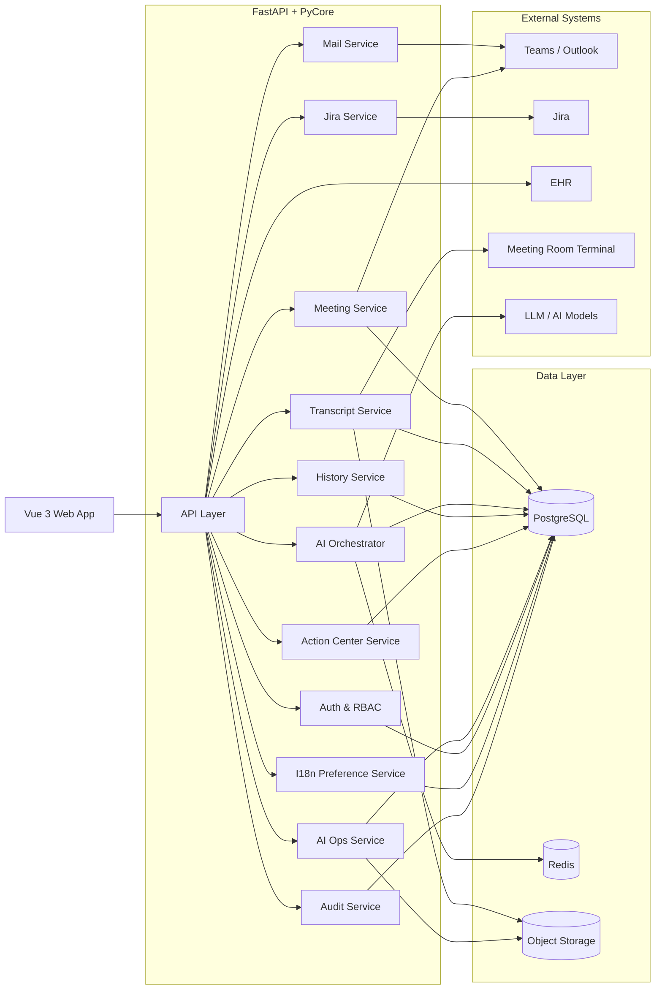
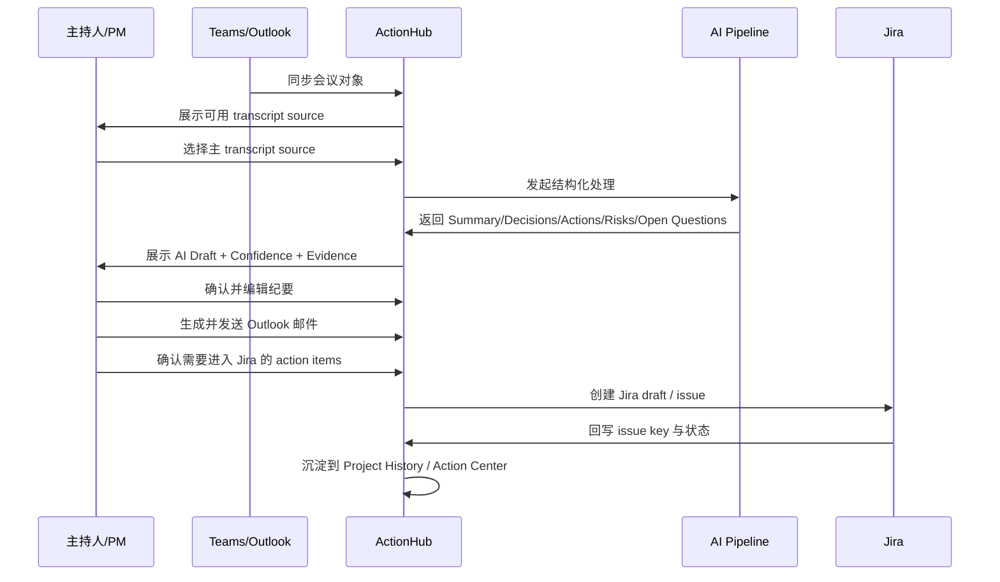
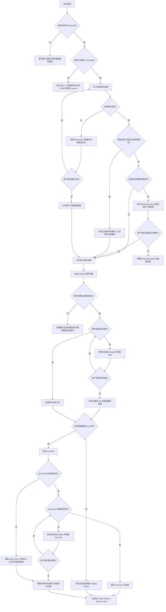
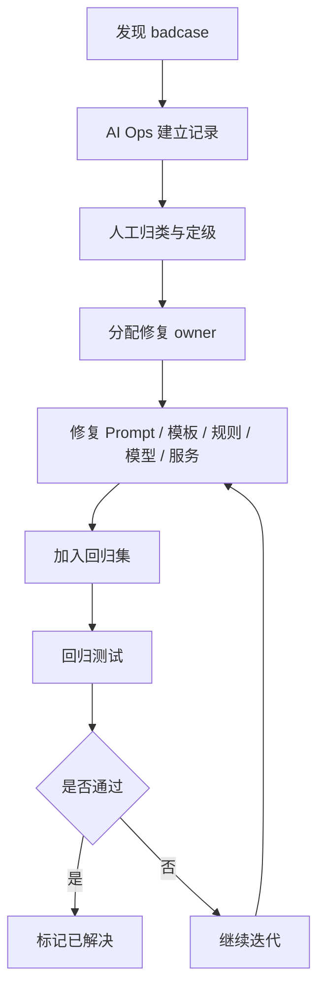

# Espressif ActionHub AI System Blueprint

> 本文档整合原 `architecture-blueprint.md`、`AI-architecture.md`、`AI-capability-spec.md` 三份文件，统一描述 ActionHub 的系统架构、AI 技术方案、能力规格、评测验收与版本治理。  
> 目标受众包括：AI 产品经理、架构评审、算法 / LLM 工程、后端、前端、测试、运营与管理员。  
> 产品层页面范围、业务规则与用户可见 AI 边界，以 `PRD.md` 为准。

---

## 1. 文档定位

### 1.1 文档目标
这份文档用于把 ActionHub 的 AI 设计从“分散在多份架构/能力文档中的方案”收敛为一份统一蓝图，回答 5 个关键问题：

1. 系统整体是怎么搭的
2. AI 在哪些节点工作、边界是什么
3. 每个模块和 Skill 的输入输出是什么
4. 这些能力怎么评测、怎么上线、怎么回滚
5. badcase 和 AI Ops 如何形成持续优化闭环

### 1.2 文档使用场景
- 架构评审
- 研发实现对齐
- 测试与验收口径对齐
- AI PM 项目沉淀与面试展示
- 后续版本演进和治理

### 1.3 与其他文档关系
- `PRD.md`：负责产品目标、页面、规则、状态体系、权限和版本范围
- `roadmap-final.md`：负责版本阶段、why now、路线图
- 本文档：负责系统蓝图、AI 技术设计、模块/Skill 执行规格、评测门槛与版本治理

---

## 2. 架构目标与设计原则

### 2.1 架构目标
ActionHub 服务于一个以会议结果处理为核心的企业协同系统。目标不是做全自治 Agent，而是在 `workflow` 主干上，用可控的 AI 能力完成：

- 结构化纪要生成
- action item 提取
- owner / deadline 识别
- 路由建议
- 跨会议 follow-up 建议
- blocker 趋势识别
- 持续优化与版本治理

### 2.2 架构必须满足
- 前端工作台清晰，支持 9 个页面协同
- 后端链路可审计、可回放、可重试
- 外部系统写操作必须人工确认
- AI 输出必须能关联 evidence 和 confidence
- Phase 2 能平滑接入 `Action Center` 与 `AI Ops`
- 能力必须可灰度、可监控、可回归、可回滚

### 2.3 设计原则
1. **Workflow-first**  
   workflow 是主干，AI 是关键节点上的受控增强层，不是自治主体。

2. **Human-in-the-loop**  
   所有高影响动作（发送邮件、创建 Jira、向 EHR 写入）必须人工确认后触发。

3. **Evidence-driven**  
   所有 AI 结果必须保留 `source_excerpt` 或 evidence refs，用户和 QA 可以追溯原始依据。

4. **Structured over free-form**  
   对 action item、owner、deadline、routing suggestion 等关键字段优先采用结构化 schema 输出，而不是纯自然语言生成。

5. **Module before Skill**  
   先把基础模块做稳，再把高频场景能力封装为 Skill，不直接做全自治多 Agent。

6. **Phase-aware**  
   MVP 以单次会议工作台为核心，Phase 2 再逐步增强跨会议上下文、Skill 层与 AI Ops。

---

## 3. 总体系统架构

## 3.1 固定技术栈

### 前端
- `Vue 3`
- `TypeScript`

### 后端
- `Python 3.11+`
- `FastAPI`
- `PyCore`

### 存储与基础设施
- `PostgreSQL`：核心业务数据
- `Redis`：缓存、短期状态、异步任务协作
- 对象存储：原始 transcript 文件、导出内容、回归样本附件

### 外部系统
- `Teams / Outlook`
- `Jira`
- `EHR`
- 会议室终端 transcript source

### AI 层
- 长上下文生成模型：用于纪要生成与邮件草稿
- 结构化抽取链路：用于 decisions、action items、risks、open questions、owner、deadline 提取
- 模板与 prompt 版本管理

---

## 3.2 逻辑架构图

---

## 3.3 系统分层说明

### 前台体验层
承载 `Dashboard`、`Meetings`、`Meeting Detail`、`My Action Items`、`Project History` 等页面，负责会后确认、结果消费和任务追踪。

### 后台运营层
承载 `Templates & Rules`、`Integrations & Admin`、`Action Center`、`AI Ops`，负责模板、规则、集成治理、任务闭环与 badcase 优化。

### Workflow 编排层
负责会议接入、主 transcript 选择、结构化生成、人工确认、邮件发送、Jira 创建、历史沉淀、跨会议追踪、AI Ops 回流的主链路编排。

### AI 能力层
承载抽取、总结、分类、路由建议、Skill 编排和回归评估等能力。

### 业务服务层
承载 Meeting / Transcript / Mail / Jira / History / ActionCenter / AIOps / Audit 等服务。

### 数据与知识层
负责会议对象、transcript、结构化结果、action item、邮件/Jira 记录、badcase、回归集、模板和规则等数据。

---

## 4. Workflow 与业务主链路

## 4.1 核心 workflow
1. `Teams / Outlook` 创建会议
2. 平台接入 `meeting object`
3. 会议结束后，主持人 / PM 指定主 transcript source
4. 触发 AI 结构化生成任务
5. 主持人 / PM 确认与编辑 AI 草稿
6. Outlook 生成并发送纪要邮件
7. Jira 任务创建
8. 结果沉淀到 `Project History / Action Center`
9. badcase 与反馈进入 `AI Ops`

## 4.2 主流程图

## 4.3 异常分支图

---

## 5. 数据对象、状态机与 API 边界

## 5.1 核心数据对象

### Meeting
- `meeting_id`
- `calendar_event_id`
- `title`
- `meeting_type`
- `project_id`
- `organizer_id`
- `participants`
- `meeting_source`
- `status`

### TranscriptSource
- `meeting_id`
- `source_type`
- `source_id`
- `is_primary`
- `selected_by`
- `selected_at`
- `transcript_version`

### StructuredMinutes
- `meeting_id`
- `summary`
- `decisions`
- `action_items`
- `risks_blockers`
- `open_questions`
- `confidence_score`
- `template_version`
- `model_version`

### ActionItem
- `action_item_id`
- `meeting_id`
- `title`
- `description`
- `owner_name`
- `deadline`
- `review_status`
- `routing_suggestion`
- `final_routing`
- `jira_issue_key`
- `source_excerpt`

### Badcase
- `badcase_id`
- `meeting_id`
- `module_name`
- `badcase_type`
- `raw_input_ref`
- `expected_output`
- `actual_output`
- `status`
- `resolved_at`

## 5.2 AI 执行通用状态机
`queued -> running -> succeeded -> failed -> user_reviewed`

## 5.3 会议状态机
`scheduled -> in_progress -> ended -> ai_draft_generated -> reviewed -> emailed -> jira_synced`

说明：
- 若邮件或 Jira 写入失败，保留失败状态并允许重试，不回退已确认纪要。

## 5.4 后端 API 边界

### 会议与详情
- `GET /meetings`
- `GET /meetings/{meeting_id}`
- `POST /meetings/{meeting_id}/primary-source`

### AI 结果与确认
- `POST /meetings/{meeting_id}/ai/generate`
- `PATCH /meetings/{meeting_id}/minutes`
- `POST /meetings/{meeting_id}/confirm`

### 邮件与 Jira
- `POST /meetings/{meeting_id}/email-draft`
- `POST /meetings/{meeting_id}/email-send`
- `POST /meetings/{meeting_id}/jira-draft`
- `POST /meetings/{meeting_id}/jira-create`

### 历史与任务中心
- `GET /projects/{project_id}/history`
- `GET /action-center/items`
- `PATCH /action-center/items/{action_item_id}`

### AI Ops
- `GET /ai-ops/metrics`
- `GET /ai-ops/badcases`
- `POST /ai-ops/badcases`
- `PATCH /ai-ops/badcases/{badcase_id}`

### 用户偏好
- `GET /me/preferences`
- `PATCH /me/preferences/language`

## 5.5 异步任务
- 会议同步
- Transcript 拉取与解析
- AI 结构化生成
- 邮件草稿生成
- Jira draft 生成
- 指标聚合
- Badcase 回归任务

---

## 6. AI 能力分层设计

## 6.1 能力分层

| 层级 | 作用 | 典型能力 |
|---|---|---|
| Base Model Layer | 通用生成 / 抽取能力 | 长上下文总结、JSON 输出 |
| AI Module Layer | 单一职责模块 | `Minutes Structuring`、`Action Item Extraction` |
| AI Skill Layer | 面向场景的能力包 | `Management Summary Skill`、`Cross-meeting Follow-up Skill` |
| Workflow Layer | 把结果送到页面与业务流 | `Meeting Detail`、`Action Center`、`AI Ops` |

## 6.2 设计原则
- 先模块化，再 Skill 化，不直接做全自治 Agent
- Skill 只负责分析、生成、建议，不直接执行高影响写操作
- 所有能力都必须能回溯到输入、输出、来源证据、用户反馈

## 6.3 Agent 边界
ActionHub 中的 Agent 不是全链路自治 Agent，而是关键节点的受控编排者。

### 负责
- 根据会议类型选择模板和处理策略
- 将 transcript 组织成结构化结果
- 判断内容归属（decision、action item、risk、open question）
- 给出 action item 的路由建议
- Phase 2 做跨会议上下文串联与 follow-up 建议

### 不负责
- 自动替人做决策
- 自动发送高影响邮件
- 自动强制分派任务
- 自动创建未经确认的 Jira 事项

### 编排方式
- MVP：任务型编排，单次会议按任务链依次调用
- Phase 2：引入跨任务上下文状态管理，但仍不做全自治多 Agent

---

## 7. AI 模块与能力规格

## 7.1 通用输入输出契约

### 通用输入
- `meeting_id`
- `project_id`
- `meeting_type`
- `primary_transcript`
- `structured_minutes`
- `action_items`
- `historical_context`（Phase 2 可选）
- `user_language`
- `skill_trigger_source`
- `skill_trigger_user_id`

### 通用输出
- `skill_name`
- `skill_version`
- `output_payload`
- `confidence_score`
- `source_excerpt[]`
- `risk_flags[]`
- `recommended_actions[]`
- `feedback_state`：`unreviewed / accepted / edited / rejected`

### 通用审计字段
- `triggered_at`
- `completed_at`
- `model_name`
- `latency_ms`
- `fallback_used`
- `error_code`
- `reviewed_by`
- `reviewed_at`

## 7.2 Capability Spec 模板
每个 AI 能力都必须补齐以下 10 项：
- 目标
- 触发条件
- 输入
- 输出 schema
- 成功定义
- 失败定义
- 正例 / 反例 / 边界例
- 页面展示方式
- 用户纠错方式
- 上线门槛

## 7.3 Minutes Structuring

### 目标
把单次会议 transcript 转成结构化纪要，供 `Meeting Detail` 展示与后续 Skill 调用。

### 触发条件
- 主 transcript source 已确定
- transcript 可用且长度在可处理范围内
- 用户点击生成，或会议结束后自动生成草稿

### 输出 schema
- `summary`
- `decisions[]`
- `action_items[]`
- `risks_blockers[]`
- `open_questions[]`
- `global_confidence`

### 成功定义
- 五个核心区域至少返回一个非空主结果，或明确返回空原因
- 每条结构化项附 `source_excerpt`
- 输出可在前端稳定渲染，不出现 JSON 解析失败

### 失败定义
- 输出空白且无错误原因
- JSON 结构错误
- 关键字段缺失
- 摘要与 transcript 明显不一致

### 页面展示
- `Meeting Detail` 中栏展示
- 默认 `AI Draft`
- 低置信度项进入 `Needs Review`

### 上线门槛
- 离线可用率 `>= 95%`
- JSON 结构成功率 `>= 99%`
- 主持人确认后可直接发送的会议占比 `>= 70%`

## 7.4 Action Item Extraction

### 目标
稳定提取会后可执行事项，支撑 `Meeting Detail`、`My Action Items`、`Action Center`。

### 必须提取字段
- `title`
- `description`
- `owner`（允许为空）
- `deadline`（允许为空）
- `source_excerpt`
- `confidence_score`
- `review_status`
- `routing_suggestion`

### 判定规则
- 必须是明确后续动作，不能只是观点、讨论、背景
- 同一句中存在“要做什么”但没有责任人时，可保留为 action item，但标 `Needs Review`
- “我们之后再看”“回头讨论一下”默认不提取为强 action item

### 正反例
正例：
- “张三周五前补齐驱动测试报告。”
- “下周二前由王五创建 Jira 并同步依赖团队。”

反例：
- “这个问题要不要再想一下。”
- “感觉这里风险不小。”

边界例：
- “这个事后面得跟进。”
  - 保留为 action item 候选，但 owner / deadline 为空，必须 `Needs Review`

### 用户纠错方式
- 可修改标题、owner、deadline、路由去向
- 删除时必须记录删除原因
- 大幅改写进入 badcase 候选池

### 上线门槛
- 精确率 `>= 0.85`
- 召回率 `>= 0.80`
- 人工补写 owner / deadline 占比达到阶段目标

## 7.5 Owner / Deadline Recognition

### 核心原则
- 宁缺毋滥，不允许幻觉补全
- 多 owner 不明确时不自动指定唯一 owner
- 相对时间必须转成标准日期前，先判断是否有锚点

### 时间识别规则
- “周五前”需要以会议日期为锚点换算
- “尽快”“下周内”标为模糊时间，不自动写入正式 deadline
- 无年份日期默认按会议所在年解析，跨年风险需标记

### Needs Review 规则
以下情况强制 `Needs Review`：
- owner 缺失
- deadline 缺失
- 多人均可能为 owner
- 相对时间无法唯一换算
- transcript 原文模糊

### 上线门槛
- owner 准确率 `>= 85%`
- deadline 准确率 `>= 80%`
- 幻觉 deadline 比例 `<= 3%`

## 7.6 Routing Suggestion Skill

### 目标
对 action item 给出 `jira / ehr / email_only` 的建议，不直接写入下游系统。

### 输入
- action item 内容
- project 配置
- 会议类型
- 历史类似事项路由

### 规则
- 明确研发执行任务优先建议 `jira`
- 组织通知、HR 流程优先建议 `ehr`
- 信息同步类内容建议 `email_only`
- 当规则冲突时展示多候选建议，不自动定稿

### 页面展示
- `Meeting Detail` 右栏或 action item 行内展示建议标签
- 用户必须手动确认 `final_routing`

### 上线门槛
- Top1 建议准确率 `>= 75%`
- Top2 覆盖率 `>= 90%`

## 7.7 Risk / Blocker / Open Question Extraction

### Decision 抽取
- 定义：提取明确达成一致的结论
- 原则：必须有明确结论性表达，不把普通讨论或建议误判为 decision，未决内容进入 open question
- 输出字段：`decision_text`、`source_excerpt`、`confidence_score`

### Risk / Blocker 抽取
- 定义：提取明确风险、阻塞项、依赖问题
- 原则：只提取影响后续推进的问题，不把一般讨论或抱怨误判为 blocker
- 输出字段：`risk_text`、`source_excerpt`、`confidence_score`

### Open Question 抽取
- 定义：提取未决、待确认、待补充的问题
- 原则：没有形成结论，仍需补充信息或等待决定，不误归入 decision
- 输出字段：`question_text`、`related_owner`、`source_excerpt`、`confidence_score`

---

## 8. Skill 层设计

## 8.1 Skill 定义
Skill 不是新的底层模型，而是由 `输入契约 + 召回上下文 + Prompt / 规则 + 输出 schema + UI 触发方式 + 反馈闭环` 组成的能力包。

## 8.2 Phase 2 首批 Skills

| Skill | 主要页面 | 用户价值 | 优先级 |
|---|---|---|---|
| `Management Summary Skill` | `Meeting Detail` | 快速生成管理层可读版本 | P0 |
| `Action Focus Skill` | `Meeting Detail` / `Action Center` | 聚焦行动项与依赖 | P0 |
| `Cross-meeting Follow-up Skill` | `Action Center` | 识别连续未关闭事项 | P0 |
| `Blocker Scan Skill` | `Action Center` / `AI Ops` | 识别连续 blocker 和升级风险 | P0 |
| `Routing Suggestion Skill` | `Meeting Detail` | 建议 Jira / EHR / Email only 去向 | P1 |
| `Weekly Status Skill` | `Project History` | 汇总项目周进展与风险 | P1 |

### 不纳入 Phase 2 的能力
- 全自动发邮件
- 全自动建 Jira
- 会中实时 Agent 主持
- 多系统跨组织自动协同

## 8.3 Management Summary Skill
### 目标
把原始纪要压缩为适合管理层快速浏览的版本，强调结论、风险、决策、需要支持事项。

### 触发方式
- `Meeting Detail` 手动触发
- 项目周会/风险同步会时做弱推荐

### 输出结构
- `executive_summary`
- `top_decisions[]`
- `top_risks[]`
- `needed_support[]`
- `next_steps[]`

### 失败标准
- 只做原文压缩，没有重组信息层级
- 引入 transcript 中不存在的结论
- 对管理层无关的细节堆积过多

### 验收重点
- 摘要长度可控
- 风险与需要支持项分离清晰
- 可一键复制到邮件或周报，但不能自动外发

## 8.4 Cross-meeting Follow-up Skill
### 目标
识别连续两次及以上会议中重复出现、仍未关闭的事项，并给出 follow-up 建议。

### 输入
- 当前 action items
- 历史未关闭 action items
- project 历史摘要
- 状态变更日志

### 匹配规则
- 优先按 `action_item_id` 直连
- 无直连时按 `project_id + 语义相似度 + owner + 关键词` 做弱匹配
- 低置信匹配仅提示，不自动合并

### 输出
- `matched_previous_item`
- `carry_over_reason`
- `follow_up_suggestion`
- `escalation_hint`

### 页面展示
- `Action Center` Banner
- 行内“连续未关闭”标签
- 支持跳转原始会议记录

### 上线门槛
- 连续事项命中率 `>= 75%`
- 错误合并率 `<= 5%`

## 8.5 Blocker Scan Skill
### 目标
从多次会议中识别重复 blocker、依赖风险和需要升级处理的信号。

### 输出
- `blocker_pattern`
- `affected_project_scope`
- `frequency`
- `severity`
- `escalation_suggestion`

### 判定边界
- 普通吐槽、情绪表达不算 blocker
- 必须对进度、依赖、资源或交付产生明确影响
- 相同关键词但不同上下文不能直接视为同一 blocker

### 上线门槛
- blocker 命中率 `>= 75%`
- 严重程度分级可接受率 `>= 80%`

## 8.6 Skill 触发与治理
- 页面上下文做弱推荐，用户手动触发优先
- 每个 Skill 单独配置开关、版本号、灰度范围
- `AI Ops` 负责查看 Skill 的采用率、失败率、badcase 与回归状态
- Skill 输出保留 `skill_name`、`skill_version`、`source_excerpt`、`feedback_label`
- Skill 不得直接落库到外部系统

---

## 9. Memory、RAG 与历史上下文策略

## 9.1 MVP
只做数据沉淀，不做强 memory 召回：

- 历史会议基本信息
- 纪要结构化结果
- action item 结果与状态
- 项目维度会议列表

特点：可查但不主动召回，不做跨会议自动关联。

## 9.2 Phase 2
升级为真正的上下文 memory：

- 上次会议纪要摘要召回（用于同项目下一次会议的上下文提示）
- 未完成 action item 自动带出（在新会议 AI 草稿中显示历史未关闭事项）
- 同一项目连续 blocker 识别（pattern-level memory）
- 不同会议模板偏好记忆（per-project 配置记忆）
- 常见 owner / 项目角色映射（提升 owner 识别准确率）

## 9.3 RAG 策略
### MVP
- 不做 RAG
- 只基于单次会议主 transcript 生成结构化结果
- 历史会议数据只做可查，不做自动召回

### Phase 2
引入轻量 RAG，用途限定为：
- 召回同项目上次会议纪要摘要
- 召回历史未完成 action item
- 召回项目背景信息

### 技术方案
- 向量化目标：每次会议 summary + action items 摘要，不向量化完整 transcript
- 召回策略：按 `project_id` 限定范围，取最近 `N` 次（建议 3-5 次）
- 模型选择：优先使用轻量 embedding 模型
- 存储：优先 `pgvector + PostgreSQL`

---

## 10. MCP / 工具层与外部系统集成

## 10.1 工具层定义
| 工具 | 操作类型 | 描述 |
|---|---|---|
| `teams_read_meeting` | 读 | 拉取 Teams 会议对象 |
| `outlook_read_calendar` | 读 | 读取 Outlook 日历会议事件 |
| `outlook_send_email` | 写（需人工确认） | 发送纪要邮件 |
| `jira_create_issue` | 写（需人工确认） | 创建 Jira issue |
| `jira_read_issue` | 读 | 读取 Jira issue 状态 |
| `ehr_notify` | 写（Phase 2，需人工确认） | 向 EHR 发送通知 / 待办路由 |
| `terminal_read_transcript` | 读 | 从会议室终端拉取 transcript |

## 10.2 设计原则
- 读操作可直接执行
- 写操作必须人工确认后触发
- 所有工具调用结果写入审计日志
- 工具调用失败时保留草稿并允许重试
- 后续可平滑迁移为标准 MCP 协议工具定义

## 10.3 Jira 集成要点
- `POST /rest/api/3/issue`
- 最小必填：`project`、`issuetype`、`summary`
- `description` 使用 ADF
- `assignee` 最终落到 `accountId`
- `duedate` 格式 `YYYY-MM-DD`
- 上线前需用 `createmeta` 拉取目标站点的自定义必填项

## 10.4 Outlook 发送要点
- Microsoft Graph `sendMail`
- 权限：`Mail.Send`
- 载荷：`message` + 可选 `saveToSentItems`
- 成功返回 `202 Accepted` 不代表最终投递完成
- 需配合节流、重试、审计与草稿保留策略

---

## 11. Prompt 与模型策略

## 11.1 Prompt 分层
| 层级 | 用途 | 说明 |
|---|---|---|
| 系统级 Prompt | 定义产品边界、输出原则、禁止行为 | 所有会议类型共用 |
| 会议类型模板 Prompt | 项目周会 / 技术评审会 / 风险同步会 | 按会议类型切换 |
| 任务型 Prompt | 纪要生成、action item 抽取、risk 提取、email draft 生成 | 按输出目标调用 |
| 路由型 Prompt | 判断 action item 更适合 Jira / EHR / email only | 轻量，可用规则辅助 |

## 11.2 输出约束
- 必须输出固定 schema（JSON 结构化输出）
- `owner / deadline` 抽不到时允许留空，不允许幻觉填充
- 讨论内容不能强行写成决议
- 低置信度 action item 必须标记 `needs_review`
- 不允许自动生成 transcript 中没有文本依据的强结论
- 所有输出必须附带 `source_excerpt`

## 11.3 版本管理
- 不同会议类型使用不同模板版本号（如 `weekly_v1.2`）
- Prompt 升级时必须记录版本号与变更原因
- Badcase 修复后做回归测试，通过后更新版本号并记录

## 11.4 模型选型原则
| 能力 | 推荐方向 | 说明 |
|---|---|---|
| ASR / 转写 | 成熟商用 ASR 服务 | 不自研底层声学模型 |
| 纪要结构化生成 | 长上下文生成模型 | 需支持 `32k+` 上下文 |
| 结构化抽取 | JSON mode / constrained output | 优先保证稳定结构输出 |
| 路由建议 | 轻量 prompt + 规则组合 | 规则优先 |
| Skills 编排 | 工作流编排 + 规则路由 + 轻量模型组合 | 避免为每个 Skill 单独造模型 |
| 跨会议召回 | 轻量 embedding + pgvector | 避免独立向量数据库 |

### 补充原则
- 优先稳定可用，优先可控可审计
- MVP 阶段避免引入过重模型复杂度
- 外部模型调用必须有 fallback 和错误日志
- 不做微调，优先通过 Prompt、规则、模板、badcase 闭环迭代

---

## 12. 页面级触发与交互约束

## 12.1 Meeting Detail
- Skill 入口不超过 `3` 个主按钮，其余进入更多菜单
- 所有 Skill 输出必须可回到原始 `Summary / Actions / Risks` 视图
- Skill 结果默认不覆盖原结构化纪要
- `Needs Review` 项支持逐条确认、逐条编辑、逐条忽略
- evidence 芯片点击后必须高亮 transcript 对应片段
- owner / deadline 缺失必须显式展示

## 12.2 Action Center
- 只展示与 action 闭环强相关的 Skills
- 推荐顺序：`Cross-meeting Follow-up` > `Action Focus` > `Blocker Scan`
- 支持批量触发时必须限制条数，避免长时间阻塞
- “跨会议未关闭事项”必须支持跳转原始会议

## 12.3 AI Ops
- 展示 Skill 级采用率、失败率、平均时延、badcase 数
- 支持按 `skill_name / version / meeting_type / project_id` 过滤
- 支持对某个 Skill 版本标记“暂停灰度 / 回滚 / 继续观察”

---

## 13. 数据集、评测、上线门槛

## 13.1 测试数据集构建

### 数据来源
- 历史会议 transcript（脱敏处理后使用）
- 人工撰写的纪要
- Outlook 纪要邮件
- Jira 任务记录

### 样本类型
- 项目周会样本
- 技术评审会样本
- 风险同步会样本

### 标注维度
- Summary 可用性
- Decision 提取
- Action Item 提取
- Owner / Deadline 抽取
- Risk / Blocker 识别
- Open Question 识别

### 数据集划分
| 子集 | 用途 |
|---|---|
| 开发集 | 日常调试与 Prompt 迭代 |
| 验证集 | 模板版本升级前效果评估 |
| Badcase 回归集 | 修复后的回归验证 |
| 线上抽检集 | 上线后的稳定性监控 |

## 13.2 数据集与标注规范
### 最低样本量建议
| 能力 | 开发集 | 验证集 | 回归集 |
|---|---:|---:|---:|
| 纪要结构化 | 150 | 50 | 50 |
| Action Item 提取 | 200 | 80 | 80 |
| Owner / Deadline | 150 | 60 | 60 |
| Cross-meeting Follow-up | 100 | 40 | 40 |
| Blocker Scan | 100 | 40 | 40 |

### 标注要求
- 关键字段采用双人标注
- 争议样本进入仲裁池
- 标注规范版本化管理
- 每次规则调整后补 10-20 条新边界样本

### Badcase 入库标准
满足任一条件即入库：
- 用户删除 AI 结果并重写
- 用户将错误归因为“误提 / 漏提 / 幻觉 / 路由错误”
- 线上监控触发结构化失败或高风险告警

## 13.3 运行指标与产品指标

### 运行指标
- 成功率
- P50 / P95 时延
- 单次调用成本
- fallback 触发率
- JSON 结构成功率
- 用户人工接管率

### 产品指标
- AI 草稿采用率
- Action item 采纳率
- owner / deadline 改写占比
- Skill 触发采用率
- Skill 失败率
- badcase 回归通过率

## 13.4 发布门槛
- 离线指标达线
- 线上小流量稳定 `5-7` 天
- 高严重度 badcase 清零
- 无新增阻断型异常

---

## 14. Badcase、AI Ops 与版本治理

## 14.1 AI Ops 职责
- 管理 badcase
- 维护模块级指标
- 统计 owner / deadline / extraction 效果
- 支持回归验证与优化建议
- 管理 Skill 采用率、失败率、版本灰度

## 14.2 Badcase 分类建议
- `summary_missing`
- `decision_missing`
- `action_missing`
- `owner_wrong`
- `deadline_wrong`
- `routing_wrong`
- `evidence_mismatch`
- `mail_draft_unusable`
- `jira_draft_invalid`
- `meeting_type_wrong`
- `template_mismatch`
- `transcript_quality_issue`
- `skill_output_low_quality`

## 14.3 严重级别
- `P0`：会导致错误对外发送、错误 Jira 创建、误导管理层判断
- `P1`：会影响纪要质量和任务流转，需要尽快修复
- `P2`：不影响主流程，但影响体验或采纳率
- `P3`：文案、样式、提醒层面的轻问题

## 14.4 版本治理
### 必须版本化的对象
- Prompt 模板
- Skill 定义
- 标注规范
- 回归集
- 评测脚本
- 模板规则
- 模型版本

### 治理动作
- 每次升级都必须记录变更内容、影响范围、回归结果
- 高风险版本必须支持灰度
- Skill 必须支持暂停灰度 / 回滚 / 继续观察
- badcase 必须能关联到 `skill_version` / `template_version` / `model_version`

## 14.5 优化闭环

---

## 15. 指标采集、监控与协作分工

## 15.1 指标采集原则
- 业务指标优先基于服务端事件和状态变更计算，不依赖纯前端埋点
- 前端埋点用于补充页面访问、点击、筛选、语言切换等行为数据
- 所有核心指标都需要能追溯到 `meeting_id`、`action_item_id`、`project_id`、`user_id`
- 指标口径统一由后端聚合任务产出，避免页面各自重复计算

## 15.2 核心事件
- `meeting_synced`
- `primary_transcript_selected`
- `ai_minutes_generated`
- `minutes_confirmed`
- `email_draft_generated`
- `email_sent`
- `jira_draft_generated`
- `jira_issue_created`
- `project_history_viewed`
- `action_item_confirmed`
- `action_item_owner_updated`
- `action_item_deadline_updated`
- `cross_meeting_followup_detected`
- `blocker_pattern_detected`
- `badcase_created`
- `badcase_resolved`
- `language_switched`

## 15.3 协作分工
| 角色 | 负责内容 |
|---|---|
| AI PM | 能力定义、优先级、验收口径、badcase 分级 |
| 算法 / LLM | Prompt、模型策略、评测、版本优化 |
| 后端 | 工作流、状态机、任务队列、日志、审计 |
| 前端 | 入口、状态、纠错、反馈采集、可解释展示 |
| QA | 回归方案、线上抽检、稳定性验证 |
| 运营 / 管理员 | 模板配置、Skill 灰度、复盘与停开控制 |

---

## 16. 合并说明与命名建议

### 16.1 本文档整合来源
本文件整合了以下三份文档的内容边界：

- `architecture-blueprint.md`：系统架构、模块拆分、API 边界、状态机、权限与指标
- `AI-architecture.md`：Workflow、Agent 边界、Memory、RAG、工具层、Skills、Prompt、模型、badcase
- `AI-capability-spec.md`：能力分层、模块 / Skill 规格、输入输出契约、上线门槛、版本治理

### 16.2 合并后的收益
- 避免三份文档之间的重复叙述
- 统一“系统层 / AI 层 / 能力层 / 验收层”的关系
- 更适合 AI 产品经理做评审、项目展示和面试讲述
- 后续只需要维护一份总蓝图，再由 PRD 和 roadmap 分别承接产品与节奏视角

### 16.3 建议保留的文件体系
- `PRD.md`
- `roadmap-final.md`
- `ActionHub-AI-System-Blueprint.md`

其余原三份文件可保留为历史版本，不再作为后续主维护文档。
